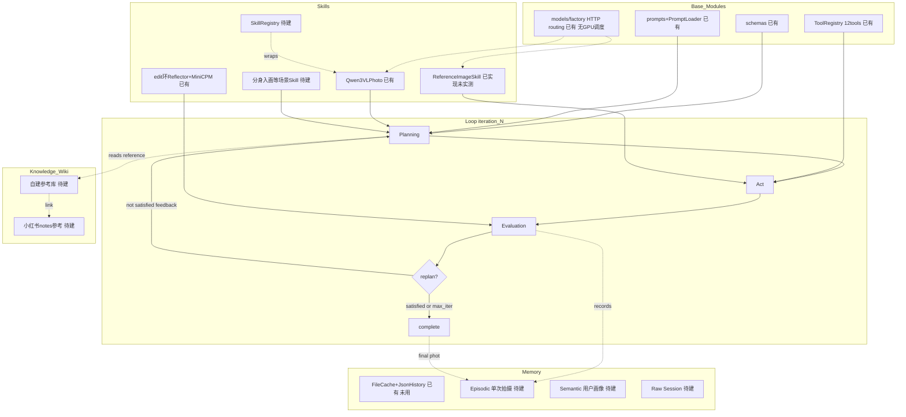
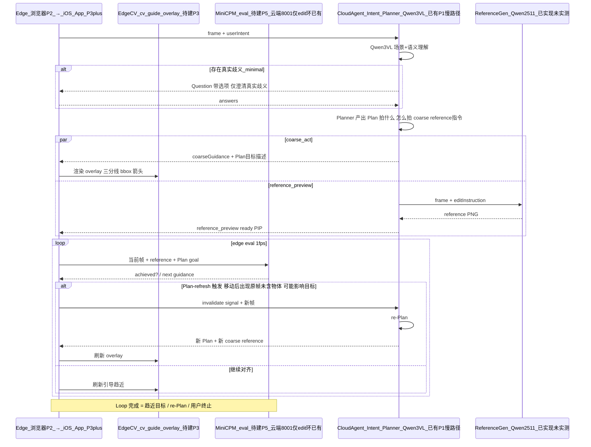
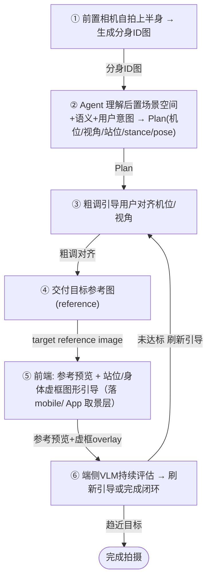
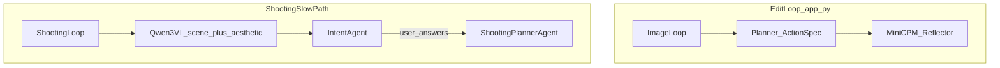
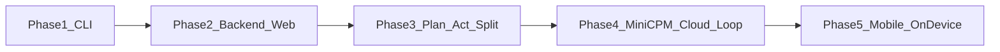
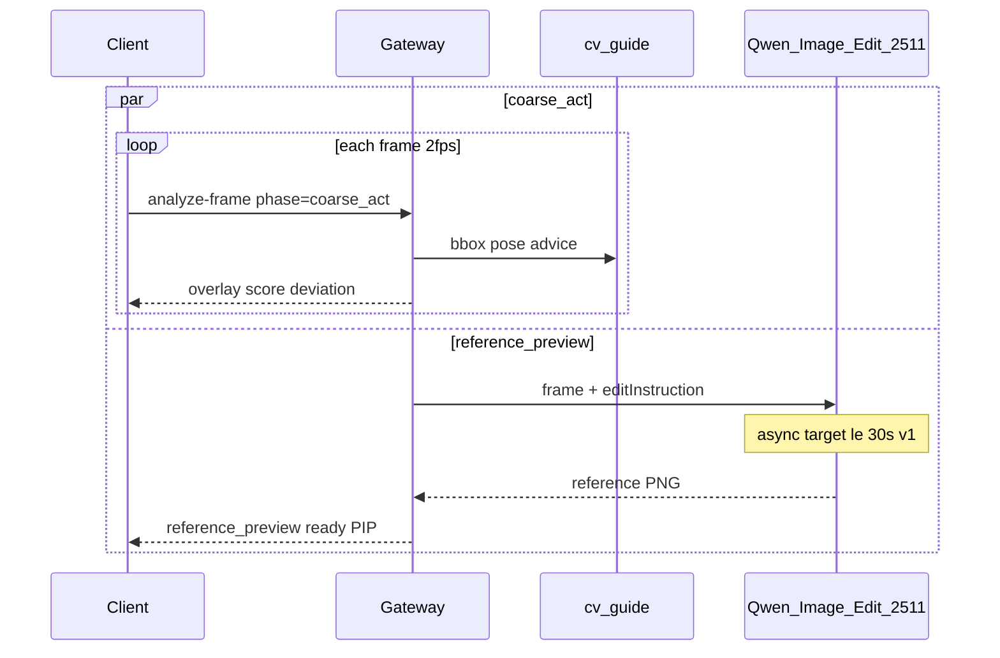
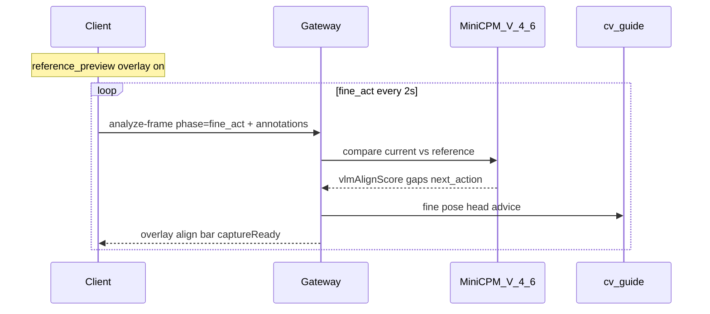
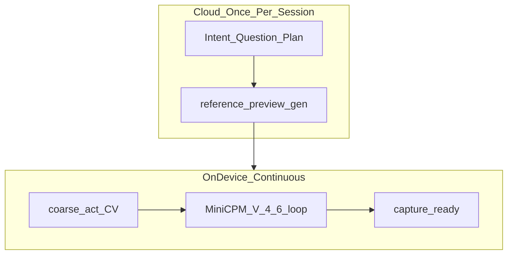
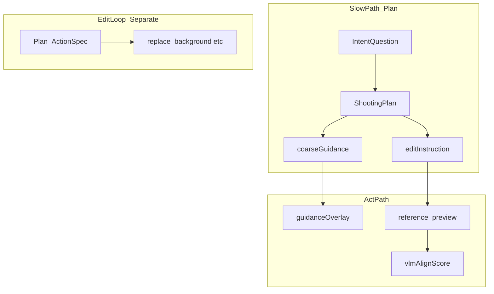

# CameraAgent MVP 期 — 方案设计及计划

- **版本**：v2.0
- **日期**：2026-08-04
- **状态**：Active — **P1 / P2（M1 / M2）✅ 已验收**；**P3 PR1 🟦 已实现未实测**；P3+ 进行中；**App-Demo 车辆（Expo/RN）提前启动于 `mobile/` 承载 P3 Channel B / P4 实时取景（未编码；App-as-Demo ≠ P5；见 §5 / §9.2）**
- **代码基线**：本仓库（拍照慢路径：`app_shooting.py` + `services/gateway` + `frontend/web`）
- **关联文档**：
  - 调研快照（只读）：`/home/pathfinder/projects/CameraAgent-docs_ori-backup/01-MVP期-方案选型调研及初步计划v2.1.md`
  - [development_workflow.md](development_workflow.md) — Git 工作流、conda 环境、WSL2/GPU、**mm-comfyui / 三服务启停**
  - [project_guide.md](project_guide.md) — 现有代码仓模块导读与扩展点
  - [p3_act_channels.md](p3_act_channels.md) — P3 双通道 Act 执行计划（PR1/PR2/PR3）
  - [p2_ui.md](p2_ui.md) / [p2_gateway_access.md](p2_gateway_access.md) — P2 H5 与 WSL/Tunnel 访问
  - [mobile_dev_setup.md](mobile_dev_setup.md) — iOS App（Expo/RN）Demo 开发运行手册（P3 Channel B / P4 车辆）
  - [flux_vllm_omni_service.md](flux_vllm_omni_service.md) — FLUX 示意图 **冷备选** 运维（默认不启）
  - [minicpm_evaluation.md](minicpm_evaluation.md) — 编辑环 MiniCPM 评估（P1/P2 拍照慢路径**不依赖**）

---

## 1. 文档定位

本文档是 CameraAgent **拍照指导 MVP** 的设计与实施计划，供后续 PR、里程碑验收和架构演进时维护。

| 维度 | 说明 |
|------|------|
| **设计** | 五阶段产品路线、模型分工、API/Schema 契约、Skill 清单 |
| **计划** | 每阶段交付物、验收标准、差距矩阵、风险 |
| **可追踪** | 每能力标注「已有 / 待建 / 复用参考」 |
| **与调研文档关系** | v2.1 为选型调研快照；本文档在 v2.1 六阶段（S0–S6）基础上，按**五条实施阶段**重组，并反映当前 `camera_agent` 实现现状 |

> **v2.0 演进注（2026-08-04）**：App-Demo 车辆（Expo/RN）提前启动于 `mobile/` 承载 P3 Channel B / P4 的实时取景（H5 降级为 parity）；P5 重定义为"端侧推理下沉"（App 外壳复用 Demo）；O4 决议 React Native (Expo)。详见 §5 / §9.2。

---

## 2. 产品目标与差异化

### 2.1 核心定位

CameraAgent 是面向**手机拍摄过程**的 AI 拍照助手（MVP 纵切：景点打卡）。与纯文字 Agent 或拍后点评产品的关键差异：

- **帧反馈闭环**：P1–P2 为单帧慢路径；P3+ 进入粗调/精调送帧（P3/P4 Act 在 iOS App Demo 上开发，见 §5 / §9.2）；P5 目标全双工预览
- **Plan-Act 闭环**：先确认意图与方案，再分阶段引导用户调整机位/站位/姿态
- **「所见 ≠ 所拍」**：示意图（G4）是拍前生成的**目标参照**，不是事后修图

### 2.2 产品目标（G1–G4）

| 目标 | MVP 覆盖 | 阶段 |
|------|----------|------|
| **G1 拍摄指导** | 粗调/精调 overlay + 双通道评分 | P3–P5 |
| **G2 智能助手** | Question 确认 + ShootingPlan | P1–P2 |
| **G3 玩法生成** | 不在 MVP | — |
| **G4 参考示意** | Qwen-Image-Edit-2511 生成 `reference_preview` | P3+ |

### 2.3 聚焦纵切场景

- **scenario**：`scenic_checkin`
- **典型地点**：西湖断桥、故宫角楼等景点人像打卡
- **用户画像**：旅行打卡人像，手机拍摄，无摄影基础

**端到端用户故事（断桥）**：

1. 用户提交一帧（P1 CLI 文件 / P2 相册上传或单次拍照）+ 文字：「在断桥拍游客照，要湖面和远山，人在右侧」
2. **Qwen3-VL** 双调用：场景事实 + 固定美学 prompt 的编辑草案（**美学调用不接收 `userIntent`**）
3. **主 Agent（IntentAgent）** 对照意图 / 场景 / 美学草案，返回 1–2 个确认问题与冲突摘要
4. 用户确认后，**ShootingPlannerAgent** 下发 `ShootingPlan` + `coarseGuidance`（P2 主要展示 `adviceText`）+ 最终 `editInstruction`
5. （P3+）并行生成 Qwen2511 目标示意图，PIP 显示；图形 overlay 合成
6. （P4+）用户按粗调移动机位；精调阶段 MiniCPM-V-4.6 对比当前帧与示意图，刷新指引
7. （P4+）多维阈值达标 → `capture_ready` + 倒计时快门

> **P1–P2 边界**：单帧慢路径（Question → Plan），**无**持续预览流 / WebRTC；`referencePreview` 仅 stub（`status=generating`）。

### 2.4 首版明确不做

- PhotoFlow Blender 全 3D 渲染
- Before the Shutter 全 3D SMPL-X 管线
- 用户上传外部参考图复刻（示意图均为自生成）
- WebRTC 全双工（首版 HTTP 送帧）
- 拍后图像编辑主链路（现有 `app.py` 编辑环保留为独立原型，不混入拍照 MVP）

### 2.5 竞品差异化

不单押模板跟拍或事后点评，而是 **Question 确认 → Plan → 粗调 ∥ 示意图 → 精调对齐**，差异化于浅影（仅评分）与 Aim（仅外部参考图叠加）。

---

## 3. 架构与流程

本章刻画 CameraAgent 的 **Agent harness 主线**：四层栈（Skills / Memory / Knowledge Wiki / 基础设施）+ Loop 骨架（iteration_N：Planning → Act → Evaluation → replan/complete），并落到两条流程——端云单次迭代协作、场景 Skill 示例（分身入画）。每层标注「已有 / 待建 / 复用参考」，与 §4 代码基线一致。

### 3.1 宏观架构（harness + loop 骨架）



**层状态表**（已有 / 待建 / 复用参考）：

| 层 | 状态 | 关键文件 / 说明 |
|----|------|----------------|
| Schema | 已有 | `schemas/{plan,action,state,tool,shooting,perception}.py` |
| System Prompt | 已有 | `prompts/*.md` + `agents/prompt_loader.py` |
| Model Routing | 已有（HTTP only，无 GPU 调度） | `models/factory.py`、`models/protocols.py`（`StructuredVisionClient`/`ImageGenerationClient`） |
| Tools-call | 已有（12 tools / 4 layer） | `tools/registry.py::create_default_tool_registry`、`schemas/tool.py`、`workflow/compiler.py`、`workflow/executor.py` |
| Loop — 编辑环 | 已有 | `workflow/image_loop.py::ImageLoop.run`；`config.yaml loop.max_iterations` |
| Loop — 拍照 Act 环 | 待建（P3+） | `workflow/shooting_loop.py` 仅两段式，无 evaluator/replan |
| Skills — base | 已有（无 registry） | `skills/qwen3vl_photo.py`、`skills/reference_image.py`（PR1 已实现未实测） |
| Skills — registry | 待建 | 现直构于 `app_shooting.py` / `services/gateway/factory.py` |
| Agents | 已有（Perception 未接线） | `agents/{planner,reflector,intent_agent,shooting_planner_agent,perception}.py` |
| Memory — 原语 | 已有（未被环使用） | `memory/{cache,history,image_state}.py`（`FileCache`=路径助手；`JsonHistoryStore`=append-only JSONL） |
| Memory — 三分类 | 待建 | 无；现用 `schemas/state.py::ExecutionState` + `workflow/state_manager.py` |
| Knowledge Wiki | 待建 | 零代码；自建库 / 小红书 notes 参考 |
| MiniCPM 端侧 / 拍照精调 | 待建（P5） | 仅编辑环 `:8001` 已有：`agents/reflector.py` + `config.yaml structured_evaluation` |
| 端云分裂 / edge runtime | 待建 | Edge：P2 = 浏览器 H5（parity）；P3+ = iOS App（Expo/RN，实时取景 + overlay + 送帧）；端侧推理运行时 = P5（待建） |

读图要点：Loop 是主线骨架——编辑环 `ImageLoop`（已有）跑完整 Plan→compile→execute→evaluate→replan，`max_iterations` 由 `config.yaml loop.max_iterations` 注入，落盘 `outputs/logs/state_iter_NN.json` 与 `outputs/plans/plan_iter_NN.json`；拍照 Act 环（待建）目前 `ShootingLoop` 仅 `collect_intent_phase`→`confirm_and_plan` 两段式。基础设施层全部已有；模型路由 HTTP-only（不变量：只注入 HTTP 客户端，不做 GPU 调度）。Skills 层 base skill 已有但无 registry；Memory 薄原语已有但未被任一环使用，三分类待建；Wiki/小红书/端侧/端云分裂零代码。

### 3.2 端云协作流程（单次迭代）

Agent 分裂为**云端**（IntentAgent/Planner/Reference-gen）与**端侧**（CV overlay / MiniCPM eval）两环境。云端负责理解场景+意图、必要 Question、Plan 生成与目标参考图；端侧负责 1fps 帧评估与引导刷新。



读图要点：**Question 极简原则**（仅真实歧义、带选项、可答默认推荐，避免打断）；`par coarse_act ∥ reference_preview` 并行交付——粗调 overlay 即时下发，Qwen2511 参考图异步（≤30s 首版）到达 PIP；端侧 eval 闭环 1fps（输入=当前帧+目标参考+Plan goal 描述 → achieved?/下一步引导）；**Plan-refresh 触发**（Evaluation 发现使现有 Plan 失效的信息，典型：原帧缺失物体在用户按引导移动后出现且可能影响目标 → invalidate → re-Plan → 重新与云端通信）；现状：慢路径已有 P1/P2，端侧 eval 循环、Plan-refresh、edge runtime 均**待建**。

### 3.3 场景 Skill 示例：分身入画（clone-self-into-scene）

分身入画 Skill 打包完整 App 流程：前置自拍生成分身 ID 图 → 后置场景理解+意图 → Plan[机位/视角/站位/stance/pose] → 粗调引导 → 交付目标参考图 → 端侧持续评估闭环。下图每步为独立节点，便于后续逐步贴效果示意。



> 每步为独立节点，便于后续逐步贴效果示意。

| 步骤 | 复用 / 待建 |
|------|-------------|
| ① 前置自拍 + 分身 ID 图生成 | 待建（前置相机采集 + 身份图生成） |
| ② 后置场景理解 + Plan | 复用参考：`IntentAgent`/`ShootingPlannerAgent`/`Qwen3VLPhotoClient`（已有），需扩展前后置协同与 stance/pose 推理 |
| ③ 粗调引导 | 待建（`cv-guide` P3） |
| ④ 目标参考图 | 复用参考：`ReferenceImageSkill`（PR1 已实现未实测） |
| ⑤ 参考预览 + 虚框 overlay | 待建（`overlay-compose` P3；前端 canvas 渲染 `GuidanceLayer`，落 `mobile/` App 取景层） |
| ⑥ 端侧 VLM 持续评估 | 待建（MiniCPM 拍照精调 P5；云端 `:8001` 仅 edit 环已有） |

---

## 4. 当前代码仓基线

### 4.1 已有能力

| 模块 | 路径 | 能力 |
|------|------|------|
| CLI 入口（编辑） | `app.py` | 图像编辑 Agent 演示（独立环） |
| CLI 入口（拍照） | `app_shooting.py` | **P1 已验收**：Question → ShootingPlan |
| 编辑主循环 | `workflow/image_loop.py` | plan → compile → execute → evaluate → replan |
| 拍照慢路径 | `workflow/shooting_loop.py` | **P1**：`collect_intent_phase` → `confirm_and_plan` |
| Intent / Planner | `agents/intent_agent.py`, `agents/shooting_planner_agent.py` | DeepSeek 结构化 JSON（文本，无图） |
| Qwen 拍照 Skill | `skills/qwen3vl_photo.py` | 场景描述 + 固定美学 prompt（禁传 `userIntent`） |
| Gateway | `services/gateway/` | **P2 已验收**：Session API + 静态 H5 |
| 前端 H5 | `frontend/web/` | S0 选帧 / S1 Question / S2 Plan |
| Planner / Reflector（编辑） | `agents/planner.py`, `agents/reflector.py` | DeepSeek + Qwen bridge；MiniCPM 双图 `:8001` |
| Provider 工厂 | `models/factory.py` | `agno.google` / `agno.deepseek` / `agno.openai_compatible`；图像 `comfyui` |
| Schema | `schemas/shooting.py` / `schemas/plan.py` | 拍照契约 **与** 工具执行 Plan **并存** |
| 默认本地服务 | `scripts/restart_required_services.sh` | 编辑环三服务；**P1/P2 拍照仅需** Qwen `:8000` + `DEEPSEEK_API_KEY` |
| 测试 | `tests/` | 含 `test_shooting_*`、`test_gateway.py` |

**两环语义分离（硬边界）**：

| 环 | 入口 | 工作流 | 用途 |
|----|------|--------|------|
| **编辑环** | `app.py` | `ImageLoop` | 换背景、改姿态等工具执行；用 MiniCPM Reflector |
| **拍照慢路径** | `app_shooting.py` / Gateway | `ShootingLoop` | 意图确认 + 拍摄方案；**不**跑 `image_loop` / ComfyUI（至 P2） |

### 4.2 缺口清单（对照五阶段）

| 能力 | 阶段 | 状态 |
|------|------|------|
| 主 Agent 多 provider（DeepSeek / Gemini / 本地） | P1 | **已验收**；默认 DeepSeek（`config.yaml` `shooting.main_agent`） |
| Qwen3-VL 场景 + 美学双调用 | P1 | **已验收**（`Qwen3VLPhotoClient`） |
| Intent Question + ShootingPlan | P1 | **已验收**（`schemas/shooting.py` + `ShootingLoop`） |
| HTTP API / Session | P2 | **已验收**（内存 Session；`X-Demo-Token` 可选） |
| 手机/PC 浏览器前端 | P2 | ✅ **已验收**（相册上传 / 单次拍照；Tunnel HTTPS 可测）；P2 后 H5 降级 parity，P3+ 前端转 `mobile/` App |
| `coarseGuidance` 图形 overlay 合成 | P3 | 未开始（P2 仅展示 `adviceText`；脏 `normalized` 已容错降为 `None`） |
| Qwen-Image-Edit-2511 真出图 | P3 | 🟦 PR1 已实现未实测（`ReferenceImageSkill` + `ReferencePreviewService`；ComfyUI 真链路未跑，留 App Phase A/C 实测） |
| `analyze-frame` 粗调环 | P3 | 未开始 |
| MiniCPM-V-4.6 精调环 | P4 | 编辑环 Reflector 已接本地 `:8001`；拍照 Coach / 2s 送帧未做 |
| 原生 App + 端侧下沉 | P5 | ⬜ 未开始（注：App 作为 **Demo 车辆**已提前启动于 `mobile/` 承载 P3/P4 实时取景——H5 不支持；端侧推理仍属 P5；见 §5 Phase 5 / §9.2） |

### 4.3 复用策略

保留现有边界，**新增拍照域模块**，避免把 `workflow/image_loop.py` 改造成拍照环：

```text
schemas/          # 保留；schemas/shooting.py（拍照契约）
agents/           # 保留；IntentAgent、ShootingPlannerAgent（+ 后续 CoachAgent）
models/factory.py # 扩展 provider，不重写
workflow/         # 保留 image_loop.py；shooting_loop.py
skills/           # 拍照域（qwen3vl_photo 等）
services/gateway/ # P2 FastAPI（已落地）
frontend/web/     # P2 H5（已落地，P2 后降为 parity）
mobile/             # P3+ iOS App（Expo/RN）Demo 车辆，即 P5 App 前身（见 §9.2）
```

设计原则（与 [project_guide.md](project_guide.md) 一致）：Agno 仅用于 structured multimodal reasoning；执行、状态、工具注册为 plain Python。**禁止**在业务代码中硬编码厂商名/端点；经 factory / `config.yaml` 注入。

### 4.4 本地参考资源

| 资源 | 路径 | 用途 |
|------|------|------|
| v2.1 调研文档 | `CameraAgent-docs_ori-backup/01-MVP期-方案选型调研及初步计划v2.1.md` | API 契约、时序图、偏离策略 |
| Qwen3-VL + Qwen2511 串联 | `scripts/vlm_edit_qwen3vl_qwen2511.py` | 阶段 A/B 参考；共享 `PHOTO_INSTRUCTION_PROMPT` |
| 历史 ComfyUI skill | `00-执行计划-MVP构建期.md`（备份） | `image-to-image_qwen2511` workflow |

### 4.5 双环与拍照慢路径 Agent 流程（P1–P2 落地说明）

#### 总览



两环**禁止混用**：拍照 MVP 不调用编辑工具链；编辑环不消费 `ShootingPlan`。

#### `ShootingLoop` 两阶段

| 阶段 | 方法 | 输入 | 输出 |
|------|------|------|------|
| Intent | `collect_intent_phase` | 图像路径 + `userIntent` | `IntentPhaseResult`（questions、conflicts、sceneFacts、aestheticDraft、draftGoal） |
| Plan | `confirm_and_plan` | 同上意图 + 上一阶段结果 + `answers[]` | `PlanAndEditInstruction` + 落盘 `shooting_plan.json` |

#### 模型调用顺序（关键不变量）

```mermaid
sequenceDiagram
  participant Entry as CLI_or_Gateway
  participant Loop as ShootingLoop
  participant Qwen as Qwen3VL_8000
  participant Intent as IntentAgent_DeepSeek
  participant User as User
  participant Plan as ShootingPlannerAgent

  Entry->>Loop: collect_intent_phase
  Loop->>Qwen: describe_scene frame
  Qwen-->>Loop: SceneFacts
  Loop->>Qwen: draft_aesthetic fixed_prompt_NO_userIntent
  Qwen-->>Loop: AestheticInstructionDraft
  Loop->>Intent: userIntent plus scene plus aesthetic
  Intent-->>Loop: questions conflicts draftGoal
  Loop-->>Entry: IntentPhaseResult
  Entry->>User: show questions
  User-->>Entry: answers
  Entry->>Loop: confirm_and_plan
  Loop->>Plan: intent answers scene aesthetic conflicts
  Plan-->>Loop: PlanAndEditInstruction
  Note over Plan: referencePreview stub generating until P3
  Loop-->>Entry: plan JSON on disk
```

| 组件 | 看什么 | 绝不做什么 |
|------|--------|------------|
| Qwen 美学调用 | 仅帧 + 固定 `PHOTO_INSTRUCTION_PROMPT` | **不接收** `userIntent`（避免与 Photography SFT 目标对抗） |
| IntentAgent | 意图 + 场景事实 + 美学草案（纯文本） | 不直接改图；只出 1–2 题与冲突 |
| ShootingPlannerAgent | 用户答案 + 证据包 | 仲裁冲突；产出最终 `editInstruction`；脏 bbox `normalized`（非 4 元组）schema 降为 `None` |

#### Gateway 映射（P2）

| HTTP | Loop |
|------|------|
| `POST .../submit-intent` | `collect_intent_phase`（multipart 帧长边 ≤1280） |
| `POST .../confirm-intent` | `confirm_and_plan`（按 session 落盘 `outputs/plans/{sessionId}/`） |
| `GET .../sessions/{id}` | 读内存 Session 状态 |

H5 三屏与访问说明见 [p2_ui.md](p2_ui.md)、[p2_gateway_access.md](p2_gateway_access.md)。本机请用 `http://127.0.0.1:8787`（**不要**用浏览器打开 `0.0.0.0`）；外网演示可用 `cloudflared tunnel --url http://127.0.0.1:8787` 临时 HTTPS。

---

## 5. 五阶段实施计划

### 总览



| 阶段 | 目标 | v2.1 对应 | 当前状态 |
|------|------|-----------|----------|
| **P1** | Terminal：一帧 + 文字 → Qwen 双调用 → Question → Plan | S0–S3（无 UI） | ✅ **M1 已验收** |
| **P2** | FastAPI + 手机/PC H5：相册/拍照选帧 → Question → Plan | S0–S2 + HTTP | ✅ **M2 已验收** |
| **P3** | Plan 双通道 Act：粗指引 overlay ∥ Qwen2511 示意图（前端落 `mobile/` App） | S3 + S4 + S4' | 🟦 PR1 已实现未实测；App 车辆启动 |
| **P4** | MiniCPM-V-4.6 云端精调；~2s 送帧；双图对比 | S5 + 偏离策略 | ⬜ 未开始 |
| **P5** | 端侧推理下沉（App 外壳复用 Demo）；云端仅 Plan；端侧实时双工 | 端侧下沉 | ⬜ 未开始 |

### 模型分工总表

**P1–P2 慢路径（已落地；Plan 制定）**

| 角色 | 选型 | 职责 | 部署（默认） |
|------|------|------|--------------|
| **主 Agent** | DeepSeek（可配 Gemini / 本地） | Intent Question；确认后 ShootingPlan / `editInstruction` | 云端 API |
| **图像理解 VLM** | **Qwen3-VL Photography（FP8）** | ① 场景事实 ② 固定美学 prompt 草案（**无 userIntent**） | **vLLM `:8000`** |
| **示意图生成** | Qwen2511 / FLUX | P1–P2 **不跑**；`referencePreview.status=generating` stub | P3：ComfyUI `:8188` |

**P1/P2 运行时依赖（最小集）**：

```text
CameraAgent (ShootingLoop)
  ├─ Qwen3-VL photography    →  HTTP  vLLM :8000     【必需】
  └─ main_agent (DeepSeek)   →  HTTPS API            【必需】
# MiniCPM :8001 / ComfyUI :8188 仅编辑环或 P3+ 需要
```

**P3+ 示意图与编辑环服务（规划）**：

```text
  ├─ reference_preview (主)       →  HTTP  ComfyUI API :8188   【P3 默认启】
  │                                 ├─ Qwen2511（当前主路径）
  │                                 └─ FLUX / 后续生成（同栈 workflow，后加）
  └─ reference_preview (fallback) →  HTTP  vLLM-Omni :8010     【冷备选，默认不启】
```

- **VLM 不进 ComfyUI**；**不把 Qwen2511 接到 vLLM-Omni**。
- **Agent 不做 GPU 权重装卸调度**：只注入 HTTP 客户端；24GB 上 VLM 与 ComfyUI **串行互斥**。
- **禁止在 CameraAgent 开发中擅自改动 `mm-comfyui` conda 环境**（只 HTTP 调用；变更须单独评审）。

**P4–P5 快路径（Act 闭环）**

| 角色 | 选型 | 职责 | 部署 |
|------|------|------|------|
| **精调 Agent** | **MiniCPM-V-4.6** | 当前帧 + 目标图双图对比；指引刷新；Loop 完成 | P4 云端；P5 端侧 |
| **快路径 CV** | `cv-guide`、检测、构图分 | bbox/偏移、overlay 图层 | P3 起混合；P5 端侧 |

**关键架构决策**：主 Agent 与 Qwen3-VL 为**双模型链路**（非 v2.1「单 Qwen3-VL 包办」）；Qwen 证据与用户意图由主 Agent 仲裁。详见 §4.5。

---

### Phase 1 — CLI 验证（意图 → Question → Plan）**【M1 ✅ 已验收】**

#### 目标

在终端验证「一帧 + 文字意图 → Qwen 双调用 → Question → ShootingPlan」慢路径，无 Web UI。

#### 用户故事

```bash
python app_shooting.py \
  --image test_img/02-input_frame.jpg \
  --prompt "在断桥拍游客照，湖面和远山，人物在右侧"
```

终端输出 1–2 个 Question；用户交互确认（或 `--answers` JSON）后，落盘 `outputs/plans/shooting_plan.json`。

#### 流程

与 §4.5 时序一致：Qwen `describe_scene` → Qwen `draft_aesthetic`（无意图）→ IntentAgent → 用户答案 → ShootingPlannerAgent。

```mermaid
sequenceDiagram
  participant CLI as app_shooting
  participant Loop as ShootingLoop
  participant Qwen as Qwen3VL_8000
  participant Intent as IntentAgent
  participant User as User
  participant Plan as ShootingPlannerAgent

  CLI->>Loop: collect_intent_phase
  Loop->>Qwen: scene_then_aesthetic
  Loop->>Intent: reconcile
  Loop-->>CLI: questions
  CLI->>User: display questions
  User-->>CLI: answers
  CLI->>Loop: confirm_and_plan
  Loop->>Plan: final_bundle
  Loop-->>CLI: shooting_plan.json
```

#### 模型与 Skill

| Skill / 组件 | 输入 | 输出 |
|--------------|------|------|
| `Qwen3VLPhotoClient` | frame | `SceneFacts` + `AestheticInstructionDraft` |
| `IntentAgent`（`intent.md`） | intent + 上述证据 | `questions[]`, `draftGoal`, `conflicts` |
| `ShootingPlannerAgent`（`shooting_planner.md`） | answers + 证据 | `ShootingPlan`, `coarseGuidance`, `editInstruction` |

#### 实现路径（已落地）

| 项 | 方案 |
|----|------|
| 主环 | `workflow/shooting_loop.py`（与 `ImageLoop` 并行） |
| CLI | `app_shooting.py` |
| Provider | `config.yaml` → `shooting.main_agent` / `shooting.qwen3vl` |
| Schema | `schemas/shooting.py` |
| Prompt | `prompts/intent.md`、`prompts/shooting_planner.md` |

#### 验收标准（M1）— **已通过**

- [x] 断桥样例图 + 中文意图 → 1–2 个结构化 Question
- [x] 用户确认后输出合法 `ShootingPlan` JSON（含 `coarseGuidance` 草案、`editInstruction`）
- [x] 主 Agent provider 可通过 `config.yaml` 切换（默认 DeepSeek；Gemini 可配）
- [x] 单元测试覆盖 schema 校验与 mock 流程（`tests/test_shooting_*`）

#### 风险（已缓解 / 残留）

- 主 Agent 与 Qwen 输出格式不一致 → Pydantic + 重试；bbox `normalized` 非 4 元组时降为 `None`
- Qwen3-VL 显存 → 仅 HTTP 调 `:8000`

---

### Phase 2 — 后端 + 手机/PC 浏览器 **【M2 ✅ 已验收】**

#### 目标

搭建 `services/gateway`（FastAPI）；手机/PC 浏览器打开同源 H5，通过 **图库上传或单次相机拍照** 提交当前帧与意图，完成 S0–S2（Question → Plan）。**不做**持续实时预览流 / WebRTC。复用同一 `ShootingLoop`（契约与 P1 一致）。

#### 用户故事

1. 打开 `https://<host>/`（或局域网 HTTP 演示页；本机 `http://127.0.0.1:8787`）
2. **选帧**：从相册选择，或授权相机拍一张（单次抓拍，非持续预览）
3. 输入意图文字，点击「分析」
4. 展示 Question 卡片，用户点选确认
5. 展示 Plan 步骤条与粗调文字引导（`coarseGuidance.adviceText`；图形 overlay 可 P3 再做）

#### API

| 方法 | 路径 | 用途 |
|------|------|------|
| POST | `/api/v1/sessions` | 创建 Session（首版内存） |
| POST | `/api/v1/sessions/{id}/submit-intent` | 首帧 + `userIntent` → `IntentPhaseResult` |
| POST | `/api/v1/sessions/{id}/confirm-intent` | 用户答案 → Plan（示意图 `status=generating`，真出图留给 P3） |
| GET | `/api/v1/sessions/{id}` | 查 Session 状态 / 最近结果 |
| GET | `/` + `/static/*` | 托管 `frontend/web` |

#### 架构

```mermaid
sequenceDiagram
  participant Browser
  participant API as FastAPI_gateway
  participant Loop as ShootingLoop
  participant Qwen as Qwen_8000
  participant Agent as DeepSeek

  Browser->>Browser: gallery_or_oneshot_camera
  Browser->>API: POST sessions
  Browser->>API: POST submit-intent multipart
  API->>Loop: collect_intent_phase
  Loop->>Qwen: describe_and_aesthetic
  Loop->>Agent: questions
  API-->>Browser: IntentPhaseResult
  Browser->>API: POST confirm-intent answers
  API->>Loop: confirm_and_plan
  API-->>Browser: PlanAndEditInstruction
```

#### 目录（已落地）

```text
services/gateway/
  main.py              # uvicorn services.gateway.main:app
  factory.py           # build_shooting_loop(config)
  routes/sessions.py
  session_store.py     # 内存 Session（O6）
  image_util.py        # JPEG/PNG；长边 ≤1280
frontend/web/
  index.html / app.js / styles.css
docs/p2_ui.md
docs/p2_gateway_access.md
```

#### 非功能需求

- 本机：`http://127.0.0.1:8787`；同 WiFi：Windows 主机 IP + WSL mirrored / portproxy；外网：Cloudflare Quick Tunnel → HTTPS（无需自有域名）
- 鉴权：可选 `X-Demo-Token`（`gateway.demo_token`）
- 帧：JPEG/PNG，长边 ≤ 1280
- 相机：需 Secure Context；局域网 HTTP 优先图库上传

#### 验收标准（M2）— **已通过**

- [x] 浏览器完成选帧（上传或拍照）→ Question → Plan，输出与 P1 CLI 契约一致
- [x] 局域网或 Tunnel HTTPS 可访问（本机 + `cloudflared` 实测）
- [x] Session 状态可查询；异常帧格式有 4xx 响应
- [x] `pytest -q` 通过（含 `tests/test_gateway.py` mock loop）

#### 风险

- 浏览器 camera 与 HTTPS / Secure Context → Tunnel HTTPS 验证拍照路径
- Planner JSON 抖动（如 bbox 点数错误）→ schema 容错 + prompt 约束（已修）
- WSL2 端口对手机不可达 → mirrored / portproxy + 防火墙

> **P2 后续（v2.0）**：H5 降级为 parity（smoke-test + App 参考实现 + 无相机演示）；P3+ 前端转 `mobile/` App（见 §5 Phase 3 / §9.2）。

---

### Phase 3 — Plan 双通道 Act（粗指引 ∥ Qwen2511 示意图）

#### 目标

Plan 落地为两部分 Act：

1. **粗指引**：简明文字 + 箭头/框等图形 overlay
2. **并行示意图**：云端 Qwen2511 将 Qwen3-VL 产出的 `editInstruction` + 用户帧 → 目标效果图，下发前端 PIP 预览

> **状态（v2.0）**：🟦 PR1（通道A 示意图）已实现未实测——由 App Phase A/C 的 PIP 真机实测；⬜ PR2（通道B 粗调 loop）未开始。**前端 S3/S4 overlay canvas 落 `mobile/` App**（实时取景需 App，H5 不支持；`frontend/web/` 仅 parity）。App 执行序列见 §9.2 Phase A–C。

#### 用户故事

1. `confirm-intent` 后立即显示粗调 overlay（三分线、bbox、文字）
2. 用户按引导移动；端侧 2fps 送帧（`analyze-frame?phase=coarse_act`）
3. 并行：Qwen2511 异步生成 `reference_preview`，≤30s（首版）内 PIP 显示
4. 示意图 ready 后进入精调阶段入口（P4）

#### 流程



#### API 扩展

| 方法 | 路径 | 用途 |
|------|------|------|
| POST | `/api/v1/sessions/{id}/analyze-frame` | `phase: coarse_act \| fine_act` |
| GET | `/api/v1/sessions/{id}/reference-preview` | 轮询或 SSE 示意图状态 |

#### 示意图生成（主路径：Qwen2511）

| 项 | 取值 |
|----|------|
| 模型 | Qwen-Image-Edit-2511 |
| 参考图 | 用户确认时的首帧 JPEG |
| prompt | Qwen3-VL 输出的 `editInstruction` |
| 输出 | `reference_preview` PNG，建议 512×512 |
| 部署 | **ComfyUI 主路径已定**（`mm-comfyui` + HTTP API `:8188`；权重约定 `/mnt/ssd-models` 或本机共享库，见环境指引） |
| 流水线参考 | `scripts/vlm_edit_qwen3vl_qwen2511.py`：vLLM 出 instruction → ComfyUI 出图（禁止同进程双加载） |
| 首版时延预算 | ≤30s；优化目标 ≤10s |
| **Fallback** | FLUX.2-klein-4B @ `:8010`（[flux_vllm_omni_service.md](flux_vllm_omni_service.md)，实测 warm ~3.6s）；**冷备选，默认不启** |

**prompt 约束**（与参考实现一致）：

```text
保持人物身份、服装和场景内容不变，仅通过调整视角、构图、人物姿态等因素提升照片美感。
不得引入、臆造或描述任何新的人物、物体、或背景元素。
```

#### Skill

| Skill ID | 阶段 | 优先级 |
|----------|------|--------|
| `overlay-compose` | P3 | P1 |
| `cv-guide` | P3 | P1 |
| `composition-score` | P3 | P2 |
| `reference-image-qwen2511` | P3 | P0 |
| `reference-image-flux` | P3 | P1（fallback） |
| `plan-deviation` | P3–P4 | P1 |

#### ShootingPlan 状态机

| stepId | 标题 | skillIds | 完成条件 |
|--------|------|----------|----------|
| `s0_intent` | 意图确认 | Qwen3-VL, MainAgent | 用户 `confirm-intent` |
| `s1_coarse_act` | 粗调：站位/景别/机位 | `cv-guide`, `composition-score`, `overlay-compose` | `compositionScoreMin ≥ 0.55` 且无 `severe` |
| `s2_fine_act` | 精调：姿态/对齐示意图 | `vlm-align`, `cv-guide` | `vlmAlignScoreMin ≥ 0.7` 且 `compositionScoreMin ≥ 0.75` |
| `s3_capture` | 快门 | `cv-guide` | `capture_ready` |

#### 验收标准（M3）

- [ ] `confirm-intent` 后粗调 overlay 与 Plan 同步显示
- [ ] Qwen2511 示意图异步到达，PIP 可预览
- [ ] `analyze-frame` 粗调阶段返回 `compositionScore`、`planDeviation`
- [ ] 严重偏离（连续 5 帧 score < 0.35）触发 `severe` 提示

> **注（v2.0）**：M3 前端（S3/S4 overlay canvas）落 `mobile/` App，非 `frontend/web/`；PR1 由 App Phase A/C 实测。App 执行序列见 §9.2 Phase A–C。

#### 风险

- Qwen2511 ComfyUI 时延 >30s → 粗调继续，示意图晚到；可临时切 FLUX
- 示意图身份/背景漂移 → prompt 强制 preserve identity and background

---

### Phase 4 — MiniCPM-V-4.6 云端精调闭环

#### 目标

示意图下发后，Act 主脑切换为 **MiniCPM-V-4.6**（先云端部署）。每隔 **2s**（可配置）上传用户预览帧 + 文字/操作打点，与目标图双图对比，判断 Loop 是否完成，刷新指引文字。

> **状态（v2.0）**：⬜ 未开始。App 侧 = §9.2 Phase D（2s 送帧 + 参考图 alpha + `capture_ready` 倒计时）；后端 = `agents/coach.py` + MiniCPM `:8001` 接拍照环（送帧间隔 2s，O3）。

#### 用户故事

1. 示意图 PIP/半透明叠加开启
2. 每 2s 自动或手动送帧 + 可选补充说明
3. 服务端 MiniCPM-V 对比当前帧与示意图，返回差距与下一步动作
4. 达标 → `capture_ready` + 倒计时；严重偏离 → 提示退出 Plan

#### 流程



#### MiniCPM-V-4.6

| 属性 | 说明 |
|------|------|
| 模型 | [openbmb/MiniCPM-V-4.6](https://huggingface.co/openbmb/MiniCPM-V-4.6) |
| 规模 | 1.3B（SigLIP2-400M + Qwen3.5-0.8B） |
| 能力 | 多图理解；4x/16x 视觉 token 压缩 |
| P4 部署 | 云端 vLLM / 本地推理 |
| 送帧间隔 | 默认 **2s**；可配置 1fps–2fps（RTX 5090 与其他任务共享显存时需调参） |

**对比 prompt 模板**：

```text
图1为当前取景，图2为目标示意图。对比姿态、构图、景别、头部朝向差距，
输出 JSON：{ "score": 0-1, "gaps": ["..."], "next_action": "..." }
```

#### 偏离策略（`plan_deviation_policy`）

| 条件 | `planDeviation` | 端侧行为 |
|------|-----------------|----------|
| `composition_score` 连续 5 帧 < 0.35 | `severe` | 弹窗：是否退出 Plan |
| 主体 bbox 与 Plan 目标区 IoU < 0.2 持续 3 帧 | `severe` | 同上 |
| 人脸消失 > 3s | `severe` | 同上 |
| 分数缓慢上升或 IoU 0.2–0.5 | `warning` | 黄色提示，继续引导 |
| 正常 | `ok` | 持续引导 |

**进展联合分**：`progressScore = 0.4 * composition_score + 0.6 * vlm_align_score`

#### 实现路径

| 项 | 方案 |
|----|------|
| Agent | 新建 `agents/coach.py`（MiniCPM 精调），或扩展 `agents/perception.py` |
| Provider | `models/minicpm_vision.py` + `factory.py` 注册 |
| 环 | `workflow/shooting_loop.py` 增加 `fine_act` 阶段 |
| 前端（App） | `mobile/` — 2s 送帧 + 参考图 alpha + `capture_ready` 倒计时（见 §9.2 Phase D） |

#### 验收标准（M4）

- [ ] 仿真 JSONL 正例达到 `capture_ready`
- [ ] 负例触发 `severe` 退出提示文案
- [ ] 2s 间隔下 P95 响应 < 3s（云端 MiniCPM）
- [ ] `progressScore` 与 overlay 文案一致可读

#### 风险

- MiniCPM 云端推理排队 → 客户端降频或队列
- 示意图未到达时 S5 降级为仅 `composition-score`（v2.1 缓解策略）

---

### Phase 5 — 端侧推理下沉（App 外壳复用 Demo）

#### 目标

**端侧推理下沉**。App 外壳已在 P3/P4 Demo 阶段建成（同栈 Expo/RN，见 §9.2），P5 不再重建 App，**唯一新增 = 端侧推理运行时**：MiniCPM-V-4.6 端侧化 + 离线 Act 环 + 弱网降级（Plan 缓存）。一次意图/Plan 由云端完成；后续 Act 环全部端侧，实现实时双工指引。

> **重定义注（v2.0）**：原 P5="开发独立手机 App + 端侧下沉" 已不成立——App 提前为 P3/P4 Demo 车辆（O4 决议 RN/Expo）。P5 收窄为"端侧推理下沉"，App 复用 Demo 外壳演进。

#### 边界划分



| 能力 | 云端 | 端侧 |
|------|------|------|
| 意图 / Question / Plan | ✓ | — |
| Qwen2511 示意图生成 | ✓（或预生成下发） | 缓存示意图 |
| 粗调 cv-guide | — | ✓ |
| 精调 MiniCPM-V-4.6 | — | ✓ |
| analyze-frame 高频调用 | — | ✓（本地） |

#### 端侧栈

- MiniCPM-V-4.6（OpenBMB 端侧部署方案）
- CV：人脸/人体检测、`offset_ok`、构图启发式
- overlay 渲染：原生相机预览层（Demo App `mobile/` 已具备取景层，P5 复用）

#### 验收标准（M5）

- [ ] 弱网/offline 下 Act 环可持续（Plan 已缓存）
- [ ] 端侧与云端 Plan 契约一致性回归通过
- [ ] 送帧延迟感知 < 500ms（端侧推理）

#### 风险

- 端侧模型体积与发热 → 4x 压缩模式、INT 量化
- iOS/Android 双端维护成本 → 技术栈已定 React Native (Expo)（O4）；双端复用同一 RN 代码库

---

## 6. 端到端架构汇总

### 6.1 组件职责

| 层 | 选型 | 职责 | 时延角色 |
|----|------|------|----------|
| 端 UI | H5（**P2 已验收**，降为 parity）+ iOS App（Expo/RN，P3+ Demo 车辆 = P5 App 前身） | 选帧/上传、Question UI、（P3+）PIP 与 overlay（落 `mobile/`） | 显示 |
| API Gateway | FastAPI `services/gateway/`（**P2 已验收**） | Session、意图、（P3+）分析与示意图任务 | 路由 |
| 主 Agent | DeepSeek / Gemini / 本地 | Intent + Plan（`IntentAgent` / `ShootingPlannerAgent`） | 慢 1–3s |
| 图像理解 | Qwen3-VL | 场景事实 + 美学草案（双调用） | 慢 1–3s |
| 示意图 | **Qwen-Image-Edit-2511** | `reference_preview` | 慢 ≤30s（P3） |
| 示意图 fallback | FLUX.2-klein-4B | 同上 | 慢 ≤3s |
| 快路径 CV | `cv-guide` | bbox、姿态、偏移 advice | <100ms（P3+） |
| 美学评分 | `composition-score` | 粗调进展、偏离判定 | 200–500ms（P3+） |
| 精调 VLM | MiniCPM-V-4.6 | 当前帧 vs 示意图 | 300–800ms @2s（P4+） |
| 叠加 | `overlay-compose` | 三分线、bbox、箭头、示意图 alpha | 端侧（P3+） |
| 状态 | Session（内存）+ 后续 `reflector_memory` | P2 Session；P4 偏离计数 | — |

### 6.2 三工作迁移（简表）

| 能力 | PhotoFlow | BTS | APA | MVP 落点 |
|------|-----------|-----|-----|----------|
| 意图/Plan | Director | Photographer | — | 主 Agent + Qwen3-VL P1–P3 |
| 粗调引导 | blueprint | Staging | cv-guide | `coarseGuidance` P3 |
| 目标示意 | — | 取景器（3D） | — | Qwen2511 `reference_preview` P3 |
| 精调评判 | pairwise | Judge | cv-guide | MiniCPM-V P4–P5 |
| 快门 | — | — | offset_ok | `capture_ready` P4–P5 |

---

## 7. Skill 清单与目录规划

### 7.1 Skill 全表

| Skill ID | 类型 | 输入 | 输出 | 阶段 | 优先级 |
|----------|------|------|------|------|--------|
| `intent-question`（IntentAgent） | P5 | evidence + intent | `questions[]` | **P1 已验收** | P0 |
| `scenic-plan`（ShootingPlannerAgent） | P5 | answers + evidence | Plan + `editInstruction` + `coarseGuidance` | **P1 已验收** | P0 |
| `qwen3vl-photo` | P1 | frame | scene + aesthetic draft | **P1 已验收** | P0 |
| `reference-image-qwen2511` | P3 | frame + `editInstruction` | `reference_preview` | P3 | P0 |
| `reference-image-flux` | P3 | frame + `editInstruction` | `reference_preview` | P3 | P1 |
| `cv-guide` | P1 | preview_frame | advice + offset | P3–P5 | P1 |
| `composition-score` | P1 | preview_frame | score + issues | P3–P5 | P2 |
| `overlay-compose` | P2 | frame + guidance | layers | P3–P5 | P1 |
| `vlm-align` | P1 | current + reference | `vlmAlignScore` | P4–P5 | P0 |
| `plan-deviation` | P5 | score history + bbox | `planDeviation` | P3–P4 | P1 |
| `reflector` | P5 | session memory | `reflectorHints` | P4 | P2 |

### 7.2 目标目录结构（P1–P2 已对齐）

```text
camera_agent/
├── app.py                    # 图像编辑环
├── app_shooting.py           # P1：拍照指导 CLI（已验收）
├── agents/
│   ├── planner.py / reflector.py
│   ├── intent_agent.py       # P1
│   ├── shooting_planner_agent.py
│   └── coach.py              # P4 待建
├── models/
├── schemas/
│   ├── plan.py               # 工具执行 Plan
│   └── shooting.py           # 拍照契约
├── workflow/
│   ├── image_loop.py
│   └── shooting_loop.py      # P1
├── skills/
│   └── qwen3vl_photo.py      # P1
├── services/gateway/         # P2（已验收）
├── frontend/web/             # P2（已验收，降为 parity）
├── mobile/                   # P3+ iOS App（Expo/RN）Demo 车辆 = P5 App 前身（见 §9.2）
└── docs/
    ├── 01-MVP期-方案设计及计划.md
    ├── p2_ui.md
    └── p2_gateway_access.md
```

---

## 8. 差距矩阵与迁移路径

| v2.1 / MVP 设计 | 阶段 | 现有实现 | 下一步 PR |
|-----------------|------|----------|-----------|
| `IntentQuestion` | P1 | **已验收** `schemas/shooting.py` + IntentAgent | — |
| `ShootingPlan` | P1 | **已验收**；与工具型 Plan 并存 | P3 overlay / preview |
| 主 Agent 多 provider | P1 | `shooting.main_agent` 默认 DeepSeek | 可选 Gemini/本地 hardening |
| Qwen3-VL 双调用 | P1 | **已验收** `skills/qwen3vl_photo.py` | — |
| HTTP Session API | P2 | **已验收** `services/gateway/` | Redis（O6 后续） |
| H5 选帧 UI | P2 | **已验收** `frontend/web/`（降为 parity） | P3 PIP / overlay 前端转 `mobile/` App |
| `coarseGuidance` overlay | P3 | 仅 `adviceText`；图层契约已有 | PR2（前端落 `mobile/` App，见 §9.1） |
| Qwen2511 示意图 | P3 | ComfyUI 客户端 + 流水线脚本 | PR1 已实现未实测（见 §9.1） |
| FLUX fallback | P3 | `openai_compatible` @ `:8010`（冷备选） | PR1 已接（默认关） |
| `analyze-frame` | P3–P4 | 无 | PR2（见 §9.1） |
| MiniCPM `vlm-align` | P4 | 编辑环 `:8001`；拍照未接 | `coach.py` + 拍照环 |
| 原生 App | P5 | App-Demo 车辆已提前启动 `mobile/`（Expo/RN，P3/P4 车辆） | 端侧推理仍 P5；App 执行序列见 §9.2 / [mobile_dev_setup.md](mobile_dev_setup.md) |

### Plan 类型分层

现有 `schemas/plan.py` 的 `Plan` 描述**工具调用步骤**（`ActionSpec` → `replace_background` 等），用于图像编辑环。

拍照 MVP 新增 `schemas/shooting.py` 的 `ShootingPlan`，描述**拍摄指导步骤**（`s0_intent` → `s1_coarse_act` → …），二者**并存、不合并**。



---

## 9. 里程碑与验收

| 里程碑 | 阶段 | 交付物 | 验收 | 状态 |
|--------|------|--------|------|------|
| **M1** | P1 | CLI `app_shooting.py` + `ShootingLoop` | Question + ShootingPlan JSON；断桥样例 | ✅ **已通过**（2026-07） |
| **M2** | P2 | FastAPI + 手机/PC H5 | 上传或拍照 → Question → Plan；与 M1 契约一致；Tunnel HTTPS 可测 | ✅ **已通过**（2026-07） |
| **M3** | P3 | 粗指引 overlay + Qwen2511 PIP（前端=`mobile/` App） | 示意图 + overlay 并行 | ⬜ 未开始（PR1 🟦 待 App 实测） |
| **M4** | P4 | MiniCPM 云端环 | `capture_ready` 闭环 + severe 负例 | ⬜ 未开始 |
| **M5** | P5 | App 复用 Demo + 端侧推理下沉 | 云端仅 Plan；端侧 Act 可持续（弱网降级） | ⬜ 未开始 |

**M1/M2 复测命令**：

```bash
# M1
python app_shooting.py --image test_img/02-input_frame.jpg \
  --prompt "在断桥拍游客照，湖面和远山，人物在右侧"
# M2
uvicorn services.gateway.main:app --host 0.0.0.0 --port 8787
# 浏览器 http://127.0.0.1:8787/ ；外网可选 cloudflared tunnel --url http://127.0.0.1:8787
pytest -q
```

### 9.1 PR 待办与验证状态

| PR | 状态 | 范围 | 验证方式 / 未测风险 |
|----|------|------|---------------------|
| **PR1** 通道A 示意图(P0) | 🟦 已实现未实测（实测=App Phase A/C） | `skills/reference_image.py`（`ReferenceImageSkill`+`PRESERVE_IDENTITY_SUFFIX`）+ `services/gateway/reference_preview.py`（`ReferencePreviewService` 异步）+ 3 路由（`confirm-intent` kickoff / `GET reference-preview` / `GET .png`）+ 前端 PIP 轮询 + `config.yaml`（`gateway.previews_dir`/`shooting.reference_preview`） | 起 `:8000`+`:8188` + `DEEPSEEK_API_KEY`，`uvicorn services.gateway.main:app`，confirm-intent → PIP ≤30s。**未测风险**：ComfyUI 真链路未跑（mock 单测已过，live 端到端留 PR3）。命中 M3 ② |
| **PR2** 通道B 粗调 loop(P1/P2) | ⬜ todo | `opencv-python`+`numpy` 入 requirements + `skills/cv_guide`/`composition_score`/`overlay_compose`/`plan_deviation` + `ShootingLoop.analyze_frame(phase=coarse_act)` + `POST /sessions/{id}/analyze-frame` + 前端 S3/S4（落 `mobile/` App，实时取景 overlay canvas） | 确定性测试图跑 CV 四件套；偏离策略表逐例（5 帧<0.35→severe 等）；`analyze-frame` mock skills。命中 M3 ①③④ |
| **PR3** 文档 + 验收 | ⬜ todo | live 集成测试（ComfyUI `:8188` 真 `editInstruction→PNG`，`RUN_LIVE_AGENT_TESTS=1`）+ §5 Phase 3 M3 验收项勾选 + §9 里程碑表 M3 状态更新 + §3 打磨 | M3 全过签收；§9 勾选并递增版本号 |

> 关联：文件级交付见 [p3_act_channels.md](p3_act_channels.md)；§5 Phase 3 为设计 rationale。

验收数据（P3+）：复用 v2.1 §10.2 仿真 JSONL（断桥 `sim-scenic-001`），扩展 `expectedReferencePreviewMs` 与 Qwen2511 字段。

### 9.2 App-Demo 执行序列（Phase A–E，未执行）

> 本节是 P3/P4 在 iOS App（Expo/RN）上的执行清单；从 §5 Phase 3 / Phase 4 反向引用。两条 Track 并行（App + 后端）。运行手册见 [mobile_dev_setup.md](mobile_dev_setup.md)。

**背景**：P3 Channel B（实时取景 overlay 循环）与 P4（持续 ~2s 送帧精调）必须靠实时取景流 + 真实交互才能判断好坏；P2（§Phase 2 / §4.5）明确"不做 WebRTC / 持续实时预览流"，H5 单次抓拍无法调试这些相机功能。故 H5 降级为 parity，以 iOS App 作为 P3/P4 开发车辆。

**前提纠正**：Flutter iOS 即使 Demo 也绕不开 Mac（`xcodebuild`/签名/模拟器均仅 macOS，WSL2 无 iOS 工具链）。Expo + Expo Go 是唯一匹配"WSL2 开发 + iPhone 真机测 + Demo 阶段零 Mac、仅发布时云端 Mac"的方案。**App-as-Demo ≠ P5**：推理仍全在云端（P3/P4 cloud）；端侧推理属 P5。

| Track | 阶段 | 交付 | 命中 | 依赖 |
|---|---|---|---|---|
| App | A 骨架+端云打通 | App 重做 M2（相册选帧→问询→方案+参考图 PIP） | M2'(App parity) | 网关+隧道 |
| App | B 实时取景预览 | `expo-camera` 实时预览+抓拍→`submit-intent` | 解锁相机调试 | A |
| App | C P3 Channel B overlay | 取景层渲染 `GuidanceLayer`+2fps `analyze-frame`+severe 横幅 | M3 ①③④ | A、B、后端 PR2 |
| App | D P4 精调闭环+快门 | 2s `fine_act`+参考图 alpha+`capture_ready`+3s 倒计时 | M4 | C、后端 P4 |
| 后端 | PR1 reference_preview（已实现未实测） | 由 App A/C 的 PIP 真机实测 | M3 ② | 起 :8188 |
| 后端 | PR2 Channel B 粗调 loop | `analyze-frame?phase=coarse_act`+CV 四件套 | M3 ①③④ | PR1 |
| 后端 | P4 fine_act | MiniCPM coach + :8001 接拍照环 | M4 | PR2 |

#### Phase A — App 骨架 + 端云打通（重做 M2 on App）
- [ ] `config.yaml` `gateway.cors_origins: ["*"]`；启 `uvicorn services.gateway.main:app --host 0.0.0.0 --port 8787` + `cloudflared tunnel --url http://127.0.0.1:8787`。
- [ ] `npx create-expo-app@latest mobile --template blank-typescript`；`npx expo install expo-image-picker expo-camera expo-secure-store react-native-safe-area-context`。
- [ ] `mobile/.env`：`EXPO_PUBLIC_API_BASE` / `EXPO_PUBLIC_DEMO_TOKEN`。
- [ ] `src/api/client.ts` 逐段移植 [frontend/web/app.js](../frontend/web/app.js)：`/api/v1`、可选 `X-Demo-Token`、FormData 严格字段名 `frame`+`userIntent`、`{answers:[{questionId,value}]}`、1500ms 轮询 `reference-preview`→`.png`。TS 类型照 [schemas/shooting.py](../schemas/shooting.py)。
- [ ] `src/screens/` 移植 S0(相册)/S1(问询 chips)/S2(方案+参考图 PIP)；本阶段 S0 只用相册。
- [ ] `npx expo start --tunnel` → Expo Go 扫码。
- **验收（M2'）**：相册选 `test_img/01-input_frame.png`+意图→问询→方案+参考图 PNG（≤30s）。兼完成 PR1 真机实测（M3 ②）。

#### Phase B — 实时取景预览 + 抓拍
- [ ] `app.json` 加 `expo-camera` plugin + `ios.infoPlist.NSCameraUsageDescription`。
- [ ] S0 增取景入口：`expo-camera` 实时预览+抓拍→`submit-intent`（复用 `client.ts`）。
- **验收**：实时预览+抓拍走通 P2。

#### Phase C — P3 Channel B 引导叠加（App + 后端 PR2，M3 ①③④）
- **App**：取景层上方透明 canvas 按 `coarseGuidance.layers`（`GuidanceLayer`：rule_of_thirds/bbox/text/arrow/reference_overlay，见 [schemas/shooting.py](../schemas/shooting.py)）渲染；静态先行（confirm-intent 返回值）；动态 ~2fps 抓帧→`POST /api/v1/sessions/{id}/analyze-frame?phase=coarse_act`→画 `guidanceOverlay`+`compositionScore`+`planDeviation`；severe 弹出退出横幅。
- **后端 PR2**（文件级见 [p3_act_channels.md](p3_act_channels.md) §4）：[schemas/shooting.py](../schemas/shooting.py) 补 `CompositionScore`/`AnalyzeFrameRequest/Response`/`progressScore`/`captureReady`；[requirements.txt](../requirements.txt) 加 `opencv-python`+`numpy`；skills `cv_guide`/`composition_score`/`overlay_compose`/`plan_deviation`；[workflow/shooting_loop.py](../workflow/shooting_loop.py) 加 `analyze_frame(phase=coarse_act)`；[services/gateway/routes/sessions.py](../services/gateway/routes/sessions.py) 加 `POST /sessions/{id}/analyze-frame`（fine_act 501）。
- **验收（M3 ①③④）**：confirm 后 overlay 同步；analyze-frame 返回 score/deviation；5 帧<0.35 触发 severe。

#### Phase D — P4 精调闭环 + 快门（App + 后端 P4，M4）
- **App**：~2s 送帧 `analyze-frame?phase=fine_act`；参考图 alpha 叠加（opacity≈0.35）+对齐进度条（`progressScore=0.4*composition+0.6*vlm_align`）；`captureReady=true`→绿色就绪+3s 倒计时；severe→退出。
- **后端 P4**：`agents/coach.py`（MiniCPM 精调）；`models/minicpm_vision.py`+`factory.py` 注册；[workflow/shooting_loop.py](../workflow/shooting_loop.py) `fine_act`；MiniCPM `:8001` 接拍照环（送帧间隔 2s，O3）。
- **验收（M4）**：正例达 `capture_ready`；负例 severe；2s P95<3s；`progressScore` 文案一致。

#### Phase E — P5 端侧下沉（未来，Demo 之外）
- 端侧 MiniCPM-V-4.6 + 离线 Act；届时 `eas build`（云端 Mac）出独立签名包。

#### 发布阶段（Mac 仅此时，云端）
```bash
cd mobile && npm i -g eas-cli && eas login
eas build --platform ios --profile preview   # 云端 macOS worker 构建+签名
eas submit -p ios                             # TestFlight / App Store
```

---

## 10. 风险、环境与依赖

### 10.1 开发与运行环境

见 [development_workflow.md](development_workflow.md)：

- WSL2 + RTX 5090（24GB），与 `mm-comfyui`、`qwen3vl-fp8`、`minicpmo` 等 conda 环境**隔离**
- 独立环境：`conda activate camera_agent`（业务）；VLM/MiniCPM 用 `qwen3vl-fp8`；图像主栈用 **已有** `mm-comfyui`（**不得擅自 pip/conda 改该环境**）
- 默认启 **三个** 服务：vLLM `:8000` + MiniCPM `:8001` + ComfyUI `:8188`；`:8010` 冷备选
- 24GB：**注意显存**，勿同时满载 VLM + MiniCPM + ComfyUI + FLUX
- pip/conda 清华镜像，避免网络卡住

**iOS App Demo 环境（v2.0）**：WSL2 + Node v22 + Expo CLI 57 + iPhone "Expo Go"（App Store）+ `cloudflared` 隧道；Demo 阶段零 Mac，发布用 EAS 云端 macOS。详见 [mobile_dev_setup.md](mobile_dev_setup.md)。Expo dev server `npx expo start --tunnel`（公网 HTTPS，绕过 WSL2 NAT）；App 只打网关 `:8787`。

### 10.2 风险表

| 风险 | 影响 | 缓解 |
|------|------|------|
| Qwen2511 时延 >30s | 精调等待 | 粗调继续；临时启 FLUX 冷备选；异步 PIP |
| 示意图身份/背景漂移 | 精调误导 | prompt 约束 + 人工抽测 |
| GPU 显存与其他任务冲突 | 服务 OOM | `nvidia-smi`；三服务可串行；勿叠 `:8010` |
| MiniCPM 端侧性能 | P5 卡顿 | P4 先本地/云端；4x token 压缩 |
| APA 无 LICENSE | 合规 | `cv-guide` 逻辑重写 |
| 主 Agent 多 provider 输出漂移 | Question/Plan 不稳定 | Pydantic 校验 + 重试 + 默认 provider；bbox `normalized` 非 4 元组降为 `None` |
| Question 过多打断 | 体验差 | 限制 1–2 个；提供默认推荐方案 |
| iOS ATS 拦截纯 HTTP | App 无法连后端 | 一律走 `cloudflared` HTTPS 隧道 |
| 相机权限缺失 | 取景崩 | `app.json` 配 `NSCameraUsageDescription` |
| Expo Go 原生模块上限 | 需自定义原生模块 | 转开发构建（dev build）/ EAS |
| WSL2→iPhone NAT 不可达 | Expo Go 连不上 dev server | `npx expo start --tunnel`（主）；mirrored/portproxy（Plan B） |

### 10.3 外部依赖

| 依赖 | 用途 | 备注 |
|------|------|------|
| `DEEPSEEK_API_KEY` | Planner（默认） | 可选改回 `GEMINI_API_KEY` + `agno.google` |
| MiniCPM-V-4.6 本地 `:8001` | Reflector 双图评估 | `transformers serve`；见 [minicpm_evaluation.md](minicpm_evaluation.md)；无需 key |
| `MINICPM_API_KEY` | 公开 API 冷备选 | 试用 key 曾 `lis_route_denied`；仅正式 key 时改 config |
| Qwen3-VL-8B Photography FP8 / vLLM | Planner vision bridge | `assets/models/..._FP8`；服务 `:8000` |
| Qwen-Image-Edit-2511 | 示意图 / 编辑主路径 | ComfyUI（`mm-comfyui`）；权重 `/mnt/ssd-models` 或共享模型库 |
| MiniCPM-V-4.6 权重 | 评估 / 精调 | `assets/models/MiniCPM-V-4.6`；公开 ModelBest 为冷备选 |
| FLUX.2-klein-4B | 冷备选 | `:8010`；默认不启 |
| Expo SDK / Expo Go | iOS App Demo 车辆 | App Store 装 Expo Go；`npx expo start --tunnel` |
| EAS（云端 macOS） | 独立签名包构建/发布 | `eas build --platform ios`；仅发布时需 Mac |

---

## 11. 开放问题（维护清单）

| ID | 问题 | 影响阶段 | 状态 |
|----|------|----------|------|
| O1 | P1 主 Agent 默认选型：DeepSeek vs Gemini vs 本地 | P1 | **已定：默认 DeepSeek**（`shooting.main_agent`）；Gemini/本地可配 |
| O2 | Qwen2511 部署：ComfyUI（`mm-comfyui`）vs diffusers 直连 | P3 | **已定：ComfyUI（`mm-comfyui`）主路径；Omni/FLUX 仅冷备选；不把 2511 接 Omni** |
| O3 | P4 送帧间隔默认值：2s vs 1fps | P4 | 倾向 2s |
| O4 | P5 技术栈：Flutter / React Native / 原生双端 | P5 | **已定：React Native (Expo)**（Demo App 即 P5 前身，同栈演进；P5 重定义为端侧下沉；详见 §5 Phase 5 / §9.2 / [mobile_dev_setup.md](mobile_dev_setup.md)） |
| O5 | `composition-score` 自研 vs PhotoFramer 集成 | P3 | 待定 |
| O6 | Session 持久化：内存 vs Redis | P2 | **首版内存已验收**；生产再议 Redis |

*关闭开放问题时，请更新上表状态并递增本文档版本号。*

---

## 附录 A — API 与 Schema 契约

### A.1 HTTP 端点（完整）

| 方法 | 路径 | 阶段 | 用途 |
|------|------|------|------|
| POST | `/api/v1/sessions` | P2 | 创建 Session |
| POST | `/api/v1/sessions/{id}/submit-intent` | P2 | 首帧 + `userIntent` → `questions[]` |
| POST | `/api/v1/sessions/{id}/confirm-intent` | P2–P3 | 用户答案 → Plan；P2 stub preview，P3 触发 Qwen2511 异步 |
| POST | `/api/v1/sessions/{id}/analyze-frame` | P3–P4（PR2） | `phase: coarse_act \| fine_act` |
| GET | `/api/v1/sessions/{id}/reference-preview` | P3 | 轮询或 SSE 示意图状态 |

### A.2 核心类型（TypeScript 参考，实现为 `schemas/shooting.py`）

> App `mobile/src/api/client.ts` 照此契约实现（参考 [frontend/web/app.js](../frontend/web/app.js) 的 fetch 段）。

```typescript
interface IntentQuestion {
  questionId: string;
  text: string;
  options?: string[];
}

interface SubmitIntentRequest {
  frame: PreviewFramePayload;
  userIntent: string;
}

interface SubmitIntentResponse {
  sessionId: string;
  questions: IntentQuestion[];
  draftGoal?: string;
}

interface ConfirmIntentRequest {
  answers: Array<{ questionId: string; value: string }>;
}

interface PlanAndEditInstruction {
  shootingPlan: ShootingPlanPayload;
  coarseGuidance: GuidanceOverlayPayload;
  editInstruction: string;
}

interface ConfirmIntentResponse extends PlanAndEditInstruction {
  referencePreview: ReferencePreviewPayload; // status: generating
}

interface ReferencePreviewPayload {
  previewId: string;
  status: "generating" | "ready" | "failed";
  dataRef?: string;
  sourceFrameId: string;
  width?: number;
  height?: number;
  latencyMs?: number;
  generator?: "qwen2511" | "flux";  // v1.0: 主路径 qwen2511
}

interface AnalyzeFrameRequest {
  frame: PreviewFramePayload;
  phase: "coarse_act" | "fine_act";
  userAnnotations?: string;  // 用户补充文字/打点描述
}

interface AnalyzeFrameResponse {
  sessionId: string;
  frameId: string;
  phase: "coarse_act" | "fine_act";
  compositionScore?: { score: number; issues: string[]; suggestions: string[] };
  vlmAlignScore?: { score: number; gaps: string[] };
  planDeviation: "ok" | "warning" | "severe";
  progressScore?: number;
  referencePreview?: ReferencePreviewPayload;
  guidanceOverlay: GuidanceOverlayPayload;
  captureReady: boolean;
  captureReason?: string;
  searchRound?: number;
  reflectorHints?: string[];
  shootingPlan?: ShootingPlanPayload;
}
```

`PreviewFramePayload`、`GuidanceOverlayPayload`、`ShootingPlanPayload` 字段定义见 v2.1 调研文档 §13.2；实现时落入 `schemas/shooting.py`。

### A.3 Python Schema 规划（`schemas/shooting.py`）

```python
# 规划结构（实施时落地，本文档仅作契约说明）
class IntentQuestion(BaseModel): ...
class GuidanceLayer(BaseModel): ...  # kind: rule_of_thirds | bbox | text | arrow | reference_overlay
class GuidanceOverlayPayload(BaseModel): ...
class ShootingPlanStep(BaseModel): ...
class ShootingPlanPayload(BaseModel): ...
class ReferencePreviewPayload(BaseModel): ...
class AnalyzeFrameResponse(BaseModel): ...
```

与 `schemas/plan.py` 的 `Plan` / `ActionSpec` **无继承关系**，通过 Session 关联。

### A.4 JSON 示例

**submit-intent 响应（S1）**

```json
{
  "sessionId": "sim-scenic-001",
  "draftGoal": "断桥游客照，湖面+远山，人物右侧",
  "questions": [
    { "questionId": "q1", "text": "您希望拍半身还是全身？", "options": ["半身", "全身"] },
    { "questionId": "q2", "text": "是否接受人物在画面右侧、湖面占下方约 1/3 的构图方案？", "options": ["接受", "我想调整"] }
  ]
}
```

**confirm-intent 响应（S3，节选）**

```json
{
  "shootingPlan": {
    "planId": "plan-001",
    "scenario": "scenic_checkin",
    "goal": "断桥游客照，湖面+远山，人物右侧半身",
    "currentStepId": "s1_coarse_act",
    "steps": [
      { "stepId": "s0_intent", "title": "意图确认", "status": "completed" },
      { "stepId": "s1_coarse_act", "title": "粗调站位与景别", "skillIds": ["cv-guide", "composition-score"], "status": "in_progress", "completionCriteria": { "compositionScoreMin": 0.55 } },
      { "stepId": "s2_fine_act", "title": "精调姿态对齐", "skillIds": ["vlm-align", "cv-guide"], "status": "pending", "completionCriteria": { "compositionScoreMin": 0.75, "vlmAlignScoreMin": 0.7 } }
    ]
  },
  "coarseGuidance": {
    "frameId": "f001",
    "layers": [
      { "kind": "rule_of_thirds", "active": true },
      { "kind": "bbox", "normalized": [0.55, 0.3, 0.35, 0.5], "label": "target_subject" },
      { "kind": "text", "text": "请让人物站到栏杆左侧，面朝湖面", "position": "top" }
    ],
    "adviceText": "粗调：先完成站位与半身景别"
  },
  "editInstruction": "Improve composition: subject on right third, half-body, lake and mountains visible, side lighting. Preserve identity and background.",
  "referencePreview": { "previewId": "rp-001", "status": "generating", "sourceFrameId": "f001", "generator": "qwen2511" }
}
```

**reference-preview ready（S4'）**

```json
{
  "previewId": "rp-001",
  "status": "ready",
  "dataRef": "sessions/sim-001/previews/rp-001.png",
  "sourceFrameId": "f001",
  "width": 512,
  "height": 512,
  "latencyMs": 28500,
  "generator": "qwen2511"
}
```

**analyze-frame 正例 — fine_act 接近完成（S5）**

```json
{
  "sessionId": "sim-scenic-001",
  "frameId": "f012",
  "phase": "fine_act",
  "compositionScore": { "score": 0.78, "issues": [], "suggestions": [] },
  "vlmAlignScore": { "score": 0.82, "gaps": ["头部可再微左转 5°"] },
  "progressScore": 0.804,
  "planDeviation": "ok",
  "referencePreview": { "previewId": "rp-001", "status": "ready", "dataRef": "sessions/sim-001/previews/rp-001.png", "generator": "qwen2511" },
  "guidanceOverlay": {
    "frameId": "f012",
    "layers": [
      { "kind": "reference_overlay", "opacity": 0.35, "previewId": "rp-001" },
      { "kind": "text", "text": "头部再向左微转", "position": "bottom" }
    ],
    "adviceText": "接近目标示意图，保持"
  },
  "captureReady": true,
  "captureReason": "coarse_and_fine_threshold_met"
}
```

### A.5 用户动作 ↔ UI 产出

| 阶段 | 用户动作 | UI 产出 |
|------|----------|---------|
| S1 | 送帧+意图 | 1–2 个确认问题卡片 |
| S2 | 点选确认 | loading |
| S3 | — | Plan 步骤条 + 粗调叠加 + 文字引导 |
| S4 | 按引导移动 | 三分线/bbox/箭头；构图分；偏离警告 |
| S4' | — | PIP **目标示意图**（Qwen2511，首版 ≤30s） |
| S5 | 微调姿态 | 示意图半透明叠加；对齐进度条；精细 advice |
| S6 | 保持 | 绿色就绪 + 3s 倒计时 |

---

## 附录 B — 参考文献

### 论文与开源

- PhotoFlow: [arXiv:2605.23771](https://arxiv.org/abs/2605.23771)
- Before the Shutter: [arXiv:2605.30318](https://arxiv.org/abs/2605.30318)
- Adaptive Photo Agent: [GitHub](https://github.com/nuglifeleoji/Adaptive-photo-agent)
- [MiniCPM-V-4.6](https://huggingface.co/openbmb/MiniCPM-V-4.6)
- [Qwen3-VL](https://github.com/QwenLM/Qwen3-VL) / Qwen-Image-Edit-2511

### 项目内

- [project_guide.md](project_guide.md)
- [development_workflow.md](development_workflow.md)
- [p2_ui.md](p2_ui.md) / [p2_gateway_access.md](p2_gateway_access.md)
- [minicpm_evaluation.md](minicpm_evaluation.md)
- [flux_vllm_omni_service.md](flux_vllm_omni_service.md)
- [mobile_dev_setup.md](mobile_dev_setup.md) — iOS App（Expo/RN）Demo 开发运行手册
- v2.1 调研快照：`CameraAgent-docs_ori-backup/01-MVP期-方案选型调研及初步计划v2.1.md`

---

*文档结束。v2.0（2026-08-04）：App-Demo 车辆（Expo/RN）线索贯穿全文（§3 Edge / §4 基线 / §5 五阶段 / §6 / §8 / §10 环境 / §11 O4）；P5 重定义为"端侧推理下沉"（App 外壳复用 Demo）；新增 §9.2 App-Demo 执行序列（Phase A–E），移除独立 §12（折叠入 §9.2）；O4 决议 React Native (Expo)；H5 降级为 parity。v1.4（2026-08-04）：O4 决议 + §12（已折叠入 §9.2）。v1.3（2026-07-25）：新增 §3 架构与流程（harness/loop 骨架、端云协作、分身入画 Skill）；§3–§10 重编号为 §4–§11；§9.1 PR 待办；PR1 已实现未实测。后续维护 §9 勾选、§9.2 TODO、§11 开放问题。*
