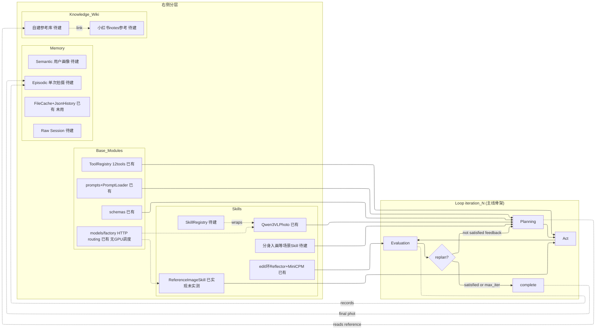
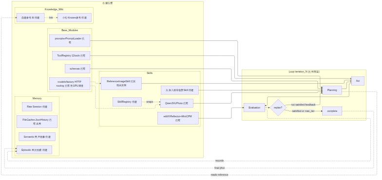
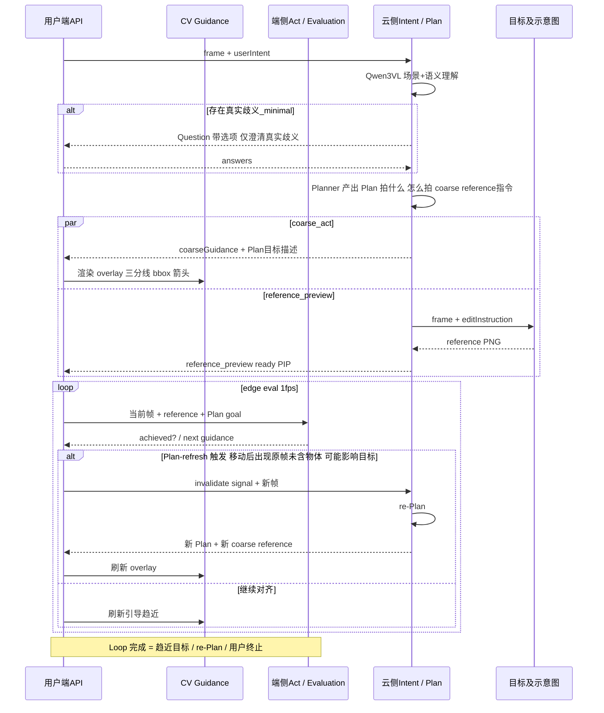
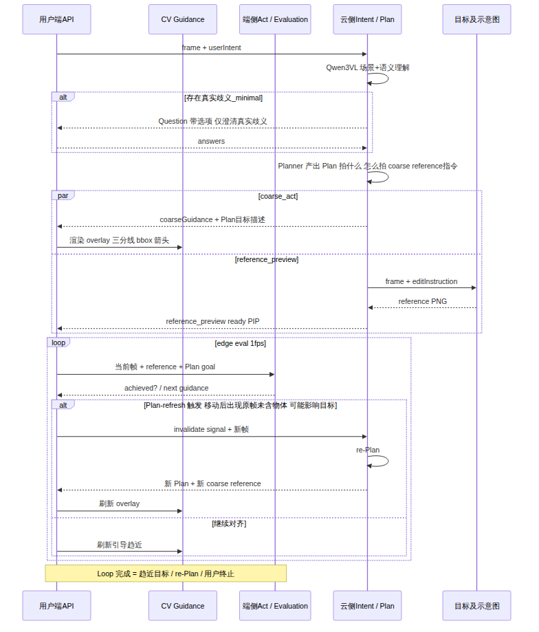
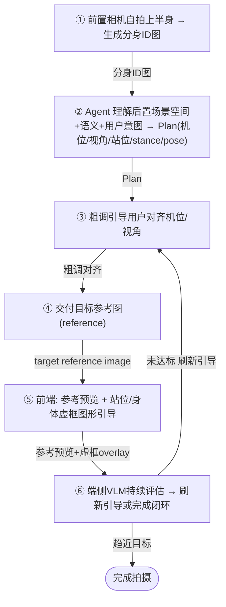
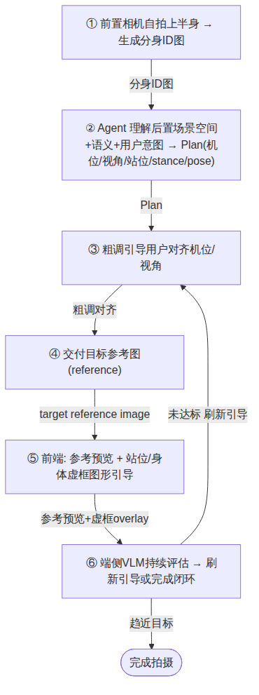

# 02 — 框架及流程图（独立维护）

- **版本**：v0.1
- **日期**：2026-07-25
- **状态**：独立迭代——与 [01-MVP期-方案设计及计划.md](01-MVP期-方案设计及计划.md) 后续同步。01 现有 §3 架构与流程为**旧快照**，本文为**迭代版**（宏观图重排、端云图精简命名）。
- **范围**：本文只收框架与流程图（宏观架构 / 端云协作 / 场景 Skill）及配套状态表，不重复 01 的设计 rationale。
- **关联文档**：
  - [01-MVP期-方案设计及计划.md](01-MVP期-方案设计及计划.md) — MVP 主文档（§3 旧快照 + §9.1 PR 待办）
  - [project_guide.md](project_guide.md) — 代码仓模块导读与扩展点
  - [p3_act_channels.md](p3_act_channels.md) — P3 双通道 Act 执行计划（PR1/PR2/PR3）

---

## 1. 宏观架构（harness + loop 骨架）

**排布**：左为 Loop iteration_N 主线骨架；右自上而下为 Skills / Base_Modules / Knowledge_Wiki / Memory。节点与连线内容与 01 §3.1 一致，仅优化排布与美观。

> 渲染图（mermaid-cli + ELK 引擎生成）：

**层状态表**（已有 / 待建 / 复用参考）：

| 层 | 状态 | 关键文件 / 说明 |
|----|------|----------------|
| Schema | 已有 | `schemas/{plan,action,state,tool,shooting,perception}.py` |
| System Prompt | 已有 | `prompts/*.md` + `agents/prompt_loader.py` |
| Model Routing | 已有（HTTP only，无 GPU 调度） | `models/factory.py`、`models/protocols.py`（`StructuredVisionClient`/`ImageGenerationClient`） |
| Tools-call | 已有（12 tools / 4 layer） | `tools/registry.py::create_default_tool_registry`、`schemas/tool.py`、`workflow/compiler.py`、`workflow/executor.py` |
| Loop — 编辑环 | 已有 | `workflow/image_loop.py::ImageLoop.run`；`config.yaml loop.max_iterations` |
| Loop — 拍照 Act 环 | 待建（P3+） | `workflow/shooting_loop.py` 仅两段式，无 evaluator/replan |
| Skills — base | 已有（无 registry） | `skills/qwen3vl_photo.py`、`skills/reference_image.py`（PR1 已实现未实测） |
| Skills — registry | 待建 | 现直构于 `app_shooting.py` / `services/gateway/factory.py` |
| Agents | 已有（Perception 未接线） | `agents/{planner,reflector,intent_agent,shooting_planner_agent,perception}.py` |
| Memory — 原语 | 已有（未被环使用） | `memory/{cache,history,image_state}.py`（`FileCache`=路径助手；`JsonHistoryStore`=append-only JSONL） |
| Memory — 三分类 | 待建 | 无；现用 `schemas/state.py::ExecutionState` + `workflow/state_manager.py` |
| Knowledge Wiki | 待建 | 零代码；自建库 / 小红书 notes 参考 |
| MiniCPM 端侧 / 拍照精调 | 待建（P5） | 仅编辑环 `:8001` 已有：`agents/reflector.py` + `config.yaml structured_evaluation` |
| 端云分裂 / edge runtime | 待建 | 当前 Edge = 浏览器送帧（P2 已有）；无端侧推理运行时 |

**读图要点**：Loop 主线骨架在左，四层栈在右按 Skills→Base→Wiki→Memory 自上而下。编辑环 `ImageLoop`（已有）跑完整 Plan→compile→execute→evaluate→replan，`max_iterations` 由 `config.yaml loop.max_iterations` 注入，落盘 `outputs/logs/state_iter_NN.json` 与 `outputs/plans/plan_iter_NN.json`；拍照 Act 环（待建）目前 `ShootingLoop` 仅 `collect_intent_phase`→`confirm_and_plan` 两段式。基础设施层全部已有；模型路由 HTTP-only（不变量：只注入 HTTP 客户端，不做 GPU 调度）。Skills 层 base skill 已有但无 registry；Memory 薄原语已有但未被任一环使用，三分类待建；Wiki/小红书/端侧/端云分裂零代码。

---

## 2. 端云协作流程（单次迭代）

Agent 分裂为**云端**（Intent / Plan / 目标示意图）与**端侧**（CV Guidance / 端侧 Act·Evaluation）两环境。云端负责理解场景+意图、必要 Question、Plan 生成与目标参考图；端侧负责 1fps 帧评估与引导刷新。

> 渲染图（mermaid-cli 生成）：

> 注：mermaid `sequenceDiagram` 宽高比由渲染器决定，源码无法强制 2:1；5 个 participant + `par`/`loop` 自然横向展开，短标签使其更宽更净。若需严格 2:1 画幅，在渲染容器/CSS 设定（如固定宽度、横向滚动）。

**读图要点**：**Question 极简原则**（仅真实歧义、带选项、可答默认推荐，避免打断）；`par coarse_act ∥ reference_preview` 并行交付——粗调 overlay 即时下发，Qwen2511 参考图异步（≤30s 首版）到达 PIP；端侧 eval 闭环 1fps（输入=当前帧+目标参考+Plan goal 描述 → achieved?/下一步引导）；**Plan-refresh 触发**（Evaluation 发现使现有 Plan 失效的信息，典型：原帧缺失物体在用户按引导移动后出现且可能影响目标 → invalidate → re-Plan → 重新与云端通信）；现状：慢路径已有 P1/P2，端侧 eval 循环、Plan-refresh、edge runtime 均**待建**。

---

## 3. 场景 Skill 示例：分身入画（clone-self-into-scene）

分身入画 Skill 打包完整 App 流程：前置自拍生成分身 ID 图 → 后置场景理解+意图 → Plan[机位/视角/站位/stance/pose] → 粗调引导 → 交付目标参考图 → 端侧持续评估闭环。下图每步为独立节点，便于后续逐步贴效果示意。

> 渲染图（mermaid-cli 生成）：

> 每步为独立节点，便于后续逐步贴效果示意。

| 步骤 | 复用 / 待建 |
|------|-------------|
| ① 前置自拍 + 分身 ID 图生成 | 待建（前置相机采集 + 身份图生成） |
| ② 后置场景理解 + Plan | 复用参考：`IntentAgent`/`ShootingPlannerAgent`/`Qwen3VLPhotoClient`（已有），需扩展前后置协同与 stance/pose 推理 |
| ③ 粗调引导 | 待建（`cv-guide` P3） |
| ④ 目标参考图 | 复用参考：`ReferenceImageSkill`（PR1 已实现未实测） |
| ⑤ 参考预览 + 虚框 overlay | 待建（`overlay-compose` P3；前端 canvas 渲染 `GuidanceLayer`） |
| ⑥ 端侧 VLM 持续评估 | 待建（MiniCPM 拍照精调 P5；云端 `:8001` 仅 edit 环已有） |

---

*本文档独立维护与迭代；与 01-MVP期-方案设计及计划.md 后续同步。*
