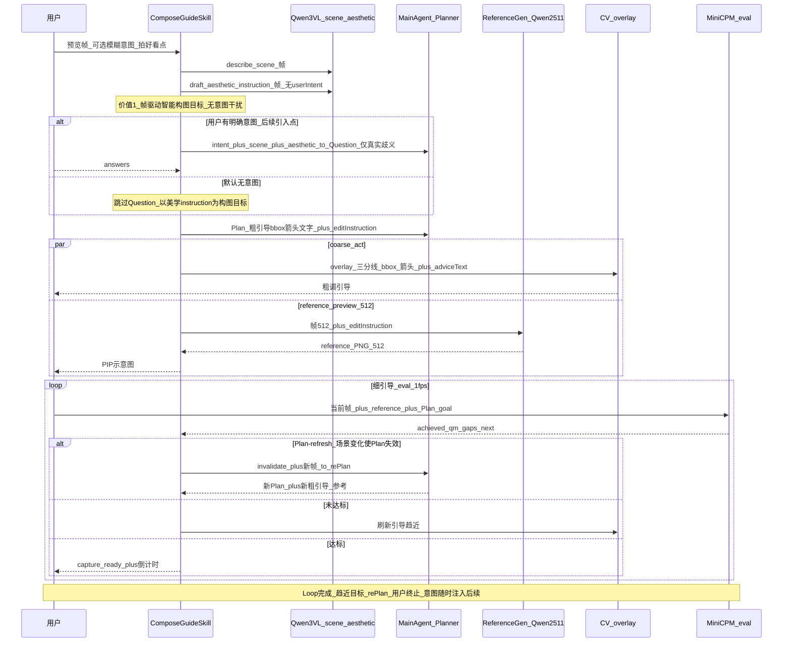
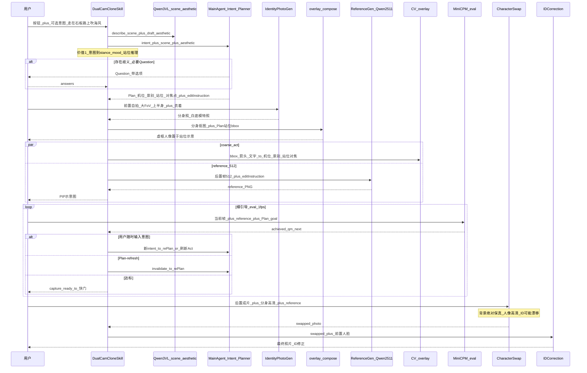

# 03 — 场景设计及 Skills 实现（独立维护）

- **版本**：v0.1
- **日期**：2026-07-25
- **状态**：独立迭代——与 [01-MVP期-方案设计及计划.md](01-MVP期-方案设计及计划.md) / [02-框架及流程图.md](02-框架及流程图.md) 后续同步。本文为**设计 + 高保真伪实现**（伪码入文内代码块，不创建真实 `.py`，不阻塞 PR2/PR3）。
- **关联文档**：[01-MVP期-方案设计及计划.md](01-MVP期-方案设计及计划.md)（§7.1 Skill 全表 / §5 Phase3-5 act-loop 契约）、[02-框架及流程图.md](02-框架及流程图.md)（harness / 端云流程 / 分身入画）、[project_guide.md](project_guide.md)、[p3_act_channels.md](p3_act_channels.md)

---

## 1. Skill 规范（完善）

### 1.1 现状缺口

- [01 §7.1 Skill 全表](01-MVP期-方案设计及计划.md) 的 `类型`列用 `P1/P2/P3/P5` **无 legend**（与 `阶段`列混用、语义不明）。
- **无 `SkillSpec` / `SkillRegistry` 代码**（仅 [01:111](01-MVP期-方案设计及计划.md)/[02:38](02-框架及流程图.md) `SkillRegistry 待建` 占位）；skills 现直构于 `app_shooting.py` / `services/gateway/factory.py`。
- `ShootingPlan` 已有 `scenario` 字段 + step `skillIds[]`+`completionCriteria`——**Skill ID 已是 plan-step ↔ skill 的 join key**，但无 registry 解析。
- 镜像对象：[schemas/tool.py](../schemas/tool.py) 的 `ToolSpec/ToolParameter/ToolLayer`（edit-loop 工具侧规范）。

### 1.2 伪 `schemas/skill.py`（镜像 ToolSpec）

```python
# 伪码——仅作设计契约，不落库（暂不入 schemas/skill.py）
from enum import StrEnum
from typing import Any
from pydantic import BaseModel, Field

class SkillKind(StrEnum):
    ATOMIC = "atomic"        # 单一能力单元
    COMPOSITE = "composite"  # 场景 skill：编排 atomic + agent loop

class SkillCategory(StrEnum):  # 修正 §7.1 歧义「类型」列
    PERCEPTION = "perception"    # 场景+美学理解：qwen3vl-photo
    PLANNING = "planning"       # 意图/方案：intent-question, scenic-plan
    GENERATION = "generation"   # 图像生成：reference-image-*, identity-photo-gen
    EVALUATION = "evaluation"   # 评分/对齐/偏离：vlm-align, composition-score, plan-deviation, reflector
    GUIDANCE = "guidance"       # 引导/叠加：cv-guide, overlay-compose
    POSTPROCESS = "postprocess"  # 成片后处理：character-swap, id-correction

class SkillParameter(BaseModel):  # 镜像 ToolParameter
    name: str
    type: str = "string"
    required: bool = False
    description: str | None = None
    default: Any = None

class SkillSpec(BaseModel):  # 镜像 ToolSpec
    skill_id: str
    kind: SkillKind
    category: SkillCategory  # composite 取主产出域
    description: str
    inputs: list[SkillParameter] = Field(default_factory=list)
    outputs: list[SkillParameter] = Field(default_factory=list)
    phase: str = ""            # P1..P5
    priority: str = ""         # P0..P2
    depends_on: list[str] = Field(default_factory=list)  # composite 编排的 skill_ids
    produces_artifact: str | None = None                  # e.g. "reference_preview"

    @property
    def required_inputs(self) -> set[str]:
        return {p.name for p in self.inputs if p.required}
```

### 1.3 伪 `skills/registry.py`（镜像 [tools/registry.py](../tools/registry.py)）

```python
# 伪码
class SkillRegistry:
    def __init__(self) -> None:
        self._skills: dict[str, "CompositeSkill"] = {}
    def register(self, skill: "CompositeSkill") -> None:
        sid = skill.spec.skill_id
        if sid in self._skills:
            raise ValueError(f"duplicate skill {sid}")
        self._skills[sid] = skill
    def get(self, skill_id: str) -> "CompositeSkill":
        if skill_id not in self._skills:
            raise KeyError(f"unknown skill {skill_id}; registered: {list(self._skills)}")
        return self._skills[skill_id]
    def resolve_step(self, step) -> list["CompositeSkill"]:
        """ShootingPlanStep.skillIds -> skills（plan-step ↔ skill join）。"""
        return [self._skills[s] for s in step.skill_ids if s in self._skills]
    def specs_markdown(self) -> str:
        return "\n".join(f"- {s.spec.skill_id} ({s.spec.category}): {s.spec.description}"
                         for s in self._skills.values())

def create_default_skill_registry(*, photo_vlm, intent_agent, planner_agent,
                                  image_generator, **deps) -> SkillRegistry:
    """注入现有 clients/agents；构造 atomic + composite 场景 skill。"""
    # 伪：注册 qwen3vl-photo / reference-image-* / cv-guide / ... / compose-guide / dual-cam-clone
    ...
```

### 1.4 伪 `skills/base/composite.py`（镜像 [tools/base/base.py](../tools/base/base.py)）

```python
# 伪码
from dataclasses import dataclass, field
from pathlib import Path
from typing import Any, Protocol

@dataclass
class SkillContext:  # 镜像 ToolContext
    inputs: dict[str, Any]               # frame / user_intent / front_selfie ...
    services: dict[str, Any]             # "photo_vlm" / "image_generator" / "reference_preview_service"
    agents: dict[str, Any]               # "intent_agent" / "planner_agent" / "coach_agent"
    state: Any                           # ExecutionState（schemas/state.py）
    output_dir: Path
    session_id: str
    def with_inputs(self, **kw) -> "SkillContext": ...  # 派生子上下文（伪）

@dataclass
class SkillResult:
    artifact_kind: str   # "guidance_overlay" | "reference_preview" | "capture" | "identity_photo" | "swapped_photo" | "final_photo"
    path: Path | None
    data: Any = None
    message: str = ""

class CompositeSkill(Protocol):
    @property
    def spec(self) -> "SkillSpec": ...
    def run(self, ctx: SkillContext) -> SkillResult: ...
```

### 1.5 完善后 Skill 全表（修正 `类型`列 legend）

| Skill ID | 类型(kind/category) | 输入 | 输出 | 阶段 | 优先级 | 状态 |
|----------|------|------|------|------|--------|------|
| `qwen3vl-photo` | atomic/perception | frame | scene + aesthetic draft | P1 | P0 | 已有 |
| `intent-question` | atomic/planning | evidence + intent | `questions[]` | P1 | P0 | 已有 |
| `scenic-plan` | atomic/planning | answers + evidence | Plan + `editInstruction` + `coarseGuidance` | P1 | P0 | 已有 |
| `reference-image-qwen2511` | atomic/generation | frame + `editInstruction` | `reference_preview` | P3 | P0 | PR1 已实现未实测 |
| `reference-image-flux` | atomic/generation | frame + `editInstruction` | `reference_preview` | P3 | P1 | PR1 已接（默认关） |
| `cv-guide` | atomic/guidance | preview_frame | advice + offset | P3–P5 | P1 | PR2 待建 |
| `composition-score` | atomic/evaluation | preview_frame | score + issues | P3–P5 | P2 | PR2 待建 |
| `overlay-compose` | atomic/guidance | frame + guidance | layers | P3–P5 | P1 | PR2 待建 |
| `vlm-align` | atomic/evaluation | current + reference | `vlmAlignScore` | P4–P5 | P0 | P4 待建 |
| `plan-deviation` | atomic/evaluation | score history + bbox | `planDeviation` | P3–P4 | P1 | PR2 待建 |
| `reflector` | atomic/evaluation | session memory | `reflectorHints` | P4 | P2 | P4 待建 |
| **`identity-photo-gen`** | atomic/generation | front_frame | 分身照(RGBA cutout) | P3+ | P1 | **本文伪实现** |
| **`character-swap`** | atomic/postprocess | rear_photo + 分身照 + reference | swapped_photo | P4+ | P1 | **本文伪实现** |
| **`id-correction`** | atomic/postprocess | swapped_photo + front_face | final_photo | P4+ | P1 | **本文伪实现** |
| **`compose-guide`** | composite/guidance | frame + user_intent? | guidanceOverlay + reference_preview + captureReady | P3–P5 | P0 | **本文伪实现** |
| **`dual-cam-clone`** | composite/postprocess | rear_frame + user_intent? + front_selfie | guidanceOverlay + reference_preview + final_photo | P3–P5 | P0 | **本文伪实现** |

> composite skill 的 `category` 取主产出域（compose-guide=guidance；dual-cam-clone=postprocess）；`depends_on` 见各 §。

---

## 2. 场景一：拍摄构图指导（`compose-guide`）

**定位**：用户默认无 Intent 或「想拍的更好看」模糊输入。**默认跳过 Question**，以 Qwen3 美学 instruction 为帧驱动构图目标；用户 Intent 作为**后续引入点**。体现 Agent 价值：instruction 智能给构图目标、Evaluation 评估并刷新引导/Plan。

### 2.1 体验流程图



### 2.2 SkillSpec

`compose-guide`（composite/guidance）：`depends_on=[qwen3vl-photo, scenic-plan, reference-image-qwen2511, cv-guide, composition-score, overlay-compose, vlm-align, plan-deviation]`；`inputs=[frame(path,req), user_intent?(str)]`；`outputs=[guidanceOverlay, reference_preview, captureReady(bool)]`；phase P3–P5；priority P0。

### 2.3 伪 `skills/scenario/compose_guide.py`

```python
"""场景一·拍摄构图指导 Skill（composite, 高保真伪实现）。

编排：qwen3vl-photo(感知) → (条件)intent-question → scenic-plan →
reference-image-qwen2511 ∥ cv-guide/composition-score/overlay-compose(粗调) →
vlm-align/plan-deviation(细调 eval) → capture。
Agent 价值：① 帧驱动 instruction ② evaluator 驱动 replan/refresh ③ Plan-refresh。
用户 Intent 作为后续引入点（默认无/模糊意图，跳过 Question）。
"""
from __future__ import annotations
from pathlib import Path
from skills.base.composite import CompositeSkill, SkillContext, SkillResult  # 伪
from schemas.skill import SkillSpec, SkillKind, SkillCategory, SkillParameter  # 伪
from schemas.shooting import PlanAndEditInstruction, IntentAnswer  # 真


class ComposeGuideSkill:
    SPEC = SkillSpec(
        skill_id="compose-guide",
        kind=SkillKind.COMPOSITE,
        category=SkillCategory.GUIDANCE,
        description="场景一：拍摄构图指导——帧驱动 instruction→Plan→粗调∥示意图→细调 eval 闭环",
        inputs=[SkillParameter(name="frame", type="path", required=True),
                SkillParameter(name="user_intent", type="string", required=False)],
        outputs=[SkillParameter(name="guidanceOverlay"),
                 SkillParameter(name="reference_preview"),
                 SkillParameter(name="captureReady", type="boolean")],
        phase="P3-P5", priority="P0",
        depends_on=["qwen3vl-photo", "scenic-plan", "reference-image-qwen2511",
                    "cv-guide", "composition-score", "overlay-compose",
                    "vlm-align", "plan-deviation"],
        produces_artifact="guidance_overlay",
    )

    @property
    def spec(self) -> SkillSpec:
        return self.SPEC

    def run(self, ctx: SkillContext) -> SkillResult:
        frame: Path = ctx.inputs["frame"]
        user_intent: str | None = ctx.inputs.get("user_intent")
        photo = ctx.services["photo_vlm"]          # Qwen3VLPhotoClient（真）
        planner = ctx.agents["planner_agent"]     # ShootingPlannerAgent（真）

        # —— 价值①：帧驱动智能构图 instruction（美学调用禁收 userIntent）——
        scene = photo.describe_scene(frame)
        aesthetic = photo.draft_aesthetic_instruction(frame)   # 不传 user_intent（真契约）

        # —— Question 默认跳过；仅当用户明确意图且存在真实歧义才问（后续引入点）——
        intent_phase = None
        answers: list[IntentAnswer] = []
        if user_intent and self._has_ambiguity(scene, aesthetic, user_intent):  # 伪
            intent_agent = ctx.agents["intent_agent"]                           # IntentAgent（真）
            intent_phase = intent_agent.analyze(
                user_intent=user_intent, scene_facts=scene, aesthetic_draft=aesthetic)
            answers = self._ask_user(intent_phase.questions)                    # 伪：端侧 UI

        # —— Plan：粗引导(bbox/箭头/文字) + editInstruction ——
        plan: PlanAndEditInstruction = planner.plan(
            user_intent=user_intent or "",
            answers=answers,
            questions=intent_phase.questions if intent_phase else [],
            conflicts=intent_phase.conflicts if intent_phase else [],
            scene_facts=scene, aesthetic_draft=aesthetic)

        # —— 并行：reference 512 生成 ∥ 粗调 overlay ——
        reference = self._kickoff_reference(ctx, frame, plan.edit_instruction)   # 伪：ReferencePreviewService.kickoff(帧512)
        self._render_overlay(ctx, plan.coarse_guidance)                          # 伪：overlay-compose

        # —— 细调 eval 闭环（MiniCPM 1fps；PR2/P4 落地前为伪 stub）——
        capture_ready = False
        while not capture_ready:
            current = self._fetch_current_frame(ctx)                          # 伪：1fps 取帧
            ev = self._evaluate(ctx, current, reference, plan)                 # 伪：vlm-align + plan-deviation
            if ev.invalidates_plan:                                           # 价值③：Plan-refresh
                plan = planner.plan(user_intent=user_intent or "", answers=answers,
                                    questions=intent_phase.questions if intent_phase else [],
                                    conflicts=intent_phase.conflicts if intent_phase else [],
                                    scene_facts=ev.new_scene, aesthetic_draft=aesthetic)
                reference = self._kickoff_reference(ctx, frame, plan.edit_instruction)
            elif not ev.achieved:                                              # 价值②：刷新引导
                self._refresh_guidance(ctx, ev.next_action)
            else:
                capture_ready = True
            if self._user_intent_injected():                                   # 后续引入点
                plan = planner.plan(... with new intent ...)                  # 伪
        return SkillResult("capture", self._capture(ctx), {"plan": plan}, "capture_ready")

    # —— 伪 helpers ——
    def _has_ambiguity(self, *a) -> bool: ...
    def _ask_user(self, qs) -> list[IntentAnswer]: ...
    def _kickoff_reference(self, ctx, frame, edit_instr): ...
    def _render_overlay(self, ctx, guidance): ...
    def _fetch_current_frame(self, ctx) -> Path: ...
    def _evaluate(self, ctx, current, reference, plan): ...   # -> {achieved, next_action, invalidates_plan, new_scene}
    def _refresh_guidance(self, ctx, next_action): ...
    def _user_intent_injected(self) -> bool: ...
    def _capture(self, ctx) -> Path: ...
```

---

## 3. 场景二：双景拍·分身入画 + Character Swap + ID 修正（`dual-cam-clone`）

**定位**：用户触发按钮 + 可选意图（如「想让自己走在石板路上，惬意吹海风」）。Agent 理解意图 + Qwen3 画面理解 → 必要 Question + Plan → 前置大 FoV 自拍 → 分身照 → 抠图置位 → 目标示意图 → 细引导 eval → 后处理 character-swap + id-correction。用户意图随时注入刷新 Act/Plan。

### 3.1 体验流程图



### 3.2 新增 atomic SkillSpec（伪）

- **`identity-photo-gen`**（atomic/generation, P3+）：`inputs=[front_frame(path,req)]`；`outputs=[identity_photo(path)]`（白底模特照→RGBA抠图）；复用：`ImageGenerationClient.edit()` + SAM/人体检测抠图。
- **`character-swap`**（atomic/postprocess, P4+）：`inputs=[rear_photo, identity_photo, reference?]`；`outputs=[swapped_photo]`；约束：**背景绝对保真**（mask 仅人像区）、人像高清 inpainting、ID 可能漂移（→ id-correction）。
- **`id-correction`**（atomic/postprocess, P4+）：`inputs=[swapped_photo, front_face]`；`outputs=[final_photo]`；face swap 修正 ID 漂移。

`dual-cam-clone`（composite/postprocess）：`depends_on=[intent-question, qwen3vl-photo, scenic-plan, identity-photo-gen, overlay-compose, reference-image-qwen2511, cv-guide, composition-score, vlm-align, plan-deviation, character-swap, id-correction]`；`inputs=[rear_frame(req), user_intent?, front_selfie(req)]`；`outputs=[guidanceOverlay, reference_preview, final_photo]`；phase P3–P5；priority P0。

### 3.3 伪文件

#### `skills/generation/identity_photo.py`

```python
"""identity-photo-gen：前置大 FoV 自拍 → 白底模特照（分身照，RGBA cutout）。"""
from skills.base.composite import CompositeSkill, SkillContext, SkillResult  # 伪
from schemas.skill import SkillSpec, SkillKind, SkillCategory, SkillParameter  # 伪
from skills.reference_image import PRESERVE_IDENTITY_SUFFIX  # 真

class IdentityPhotoGenSkill:
    SPEC = SkillSpec(
        skill_id="identity-photo-gen", kind=SkillKind.ATOMIC, category=SkillCategory.GENERATION,
        description="前置自拍上半身→白底分身照(RGBA抠图)，供 character-swap 置入后置画面",
        inputs=[SkillParameter(name="front_frame", type="path", required=True)],
        outputs=[SkillParameter(name="identity_photo", type="path")],
        phase="P3+", priority="P1", produces_artifact="identity_photo")
    @property
    def spec(self) -> SkillSpec: return self.SPEC
    def run(self, ctx: SkillContext) -> SkillResult:
        front = ctx.inputs["front_frame"]
        client = ctx.services["image_generator"]            # ImageGenerationClient（真）
        out = ctx.output_dir / "identity_raw.png"
        # 伪：1) 生成白底模特照（保持身份/衣着，禁止臆造新元素）
        client.edit(image_path=front,
                    prompt=f"白底全身模特照，保持人物身份与衣着不变。{PRESERVE_IDENTITY_SUFFIX}",
                    output_path=out)
        cutout = self._matting(out)                          # 伪：SAM/人体检测 → RGBA 抠图
        return SkillResult("identity_photo", cutout, None, "分身照")
    def _matting(self, path): ...                            # 伪
```

#### `skills/postprocess/character_swap.py`

```python
"""character-swap：后置成片人像区 inpainting 置入分身高清图；背景绝对保真，ID 可能漂移。"""
from skills.base.composite import CompositeSkill, SkillContext, SkillResult  # 伪
from schemas.skill import SkillSpec, SkillKind, SkillCategory, SkillParameter  # 伪

class CharacterSwapSkill:
    SPEC = SkillSpec(
        skill_id="character-swap", kind=SkillKind.ATOMIC, category=SkillCategory.POSTPROCESS,
        description="后置成片人像区 inpainting 换成分身高清图；背景绝对保真(mask仅人像区)",
        inputs=[SkillParameter(name="rear_photo", type="path", required=True),
                SkillParameter(name="identity_photo", type="path", required=True),
                SkillParameter(name="reference", type="path", required=False)],
        outputs=[SkillParameter(name="swapped_photo", type="path")],
        phase="P4+", priority="P1", produces_artifact="swapped_photo")
    @property
    def spec(self) -> SkillSpec: return self.SPEC
    def run(self, ctx: SkillContext) -> SkillResult:
        rear, identity, ref = ctx.inputs["rear_photo"], ctx.inputs["identity_photo"], ctx.inputs.get("reference")
        # 伪：1) 人体/人像 mask（仅人像区，背景绝对保真）
        #     2) inpainting：identity 高清人像贴入 mask 区，ref 作构图/姿态参照
        #     3) 边缘融合 → swapped_photo（ID 可能漂移，由 id-correction 修正）
        out = ctx.output_dir / "swapped.png"
        return SkillResult("swapped_photo", out, None, "character swap done")
```

#### `skills/postprocess/id_correction.py`

```python
"""id-correction：将前置人脸 swap 到 swapped_photo，修正 ID 漂移。"""
from skills.base.composite import CompositeSkill, SkillContext, SkillResult  # 伪
from schemas.skill import SkillSpec, SkillKind, SkillCategory, SkillParameter  # 伪

class IDCorrectionSkill:
    SPEC = SkillSpec(
        skill_id="id-correction", kind=SkillKind.ATOMIC, category=SkillCategory.POSTPROCESS,
        description="前置人脸 swap 到成片人像，修正 character-swap 的 ID 漂移",
        inputs=[SkillParameter(name="swapped_photo", type="path", required=True),
                SkillParameter(name="front_face", type="path", required=True)],
        outputs=[SkillParameter(name="final_photo", type="path")],
        phase="P4+", priority="P1", produces_artifact="final_photo")
    @property
    def spec(self) -> SkillSpec: return self.SPEC
    def run(self, ctx: SkillContext) -> SkillResult:
        swapped, front_face = ctx.inputs["swapped_photo"], ctx.inputs["front_face"]
        # 伪：人脸检测(前置 + 成片) → face swap(In-Swapper 等) → 边缘融合 → final_photo
        out = ctx.output_dir / "final.png"
        return SkillResult("final_photo", out, None, "id corrected")
```

#### `skills/scenario/dual_cam_clone.py`

```python
"""场景二·双景拍 Skill（composite, 高保真伪实现）。

编排：intent-question+qwen3vl-photo → scenic-plan → identity-photo-gen →
overlay-compose(分身抠图置位) → reference-image ∥ cv-guide(粗调) →
vlm-align/plan-deviation(细调 eval) → capture → character-swap → id-correction。
用户意图随时注入 → re-Plan/刷新 Act。
"""
from __future__ import annotations
from pathlib import Path
from skills.base.composite import CompositeSkill, SkillContext, SkillResult  # 伪
from schemas.skill import SkillSpec, SkillKind, SkillCategory, SkillParameter  # 伪
from schemas.shooting import PlanAndEditInstruction, IntentAnswer  # 真


class DualCamCloneSkill:
    SPEC = SkillSpec(
        skill_id="dual-cam-clone",
        kind=SkillKind.COMPOSITE,
        category=SkillCategory.POSTPROCESS,
        description="场景二：双景拍——分身入画 + character-swap + id-correction 全流程",
        inputs=[SkillParameter(name="rear_frame", type="path", required=True),
                SkillParameter(name="front_selfie", type="path", required=True),
                SkillParameter(name="user_intent", type="string", required=False)],
        outputs=[SkillParameter(name="guidanceOverlay"),
                 SkillParameter(name="reference_preview"),
                 SkillParameter(name="final_photo", type="path")],
        phase="P3-P5", priority="P0",
        depends_on=["intent-question", "qwen3vl-photo", "scenic-plan", "identity-photo-gen",
                    "overlay-compose", "reference-image-qwen2511", "cv-guide", "composition-score",
                    "vlm-align", "plan-deviation", "character-swap", "id-correction"],
        produces_artifact="final_photo")

    @property
    def spec(self) -> SkillSpec:
        return self.SPEC

    def run(self, ctx: SkillContext) -> SkillResult:
        rear: Path = ctx.inputs["rear_frame"]
        intent: str | None = ctx.inputs.get("user_intent")
        front_selfie: Path = ctx.inputs["front_selfie"]
        photo = ctx.services["photo_vlm"]               # Qwen3VLPhotoClient（真）
        intent_agent = ctx.agents["intent_agent"]       # IntentAgent（真）
        planner = ctx.agents["planner_agent"]           # ShootingPlannerAgent（真）
        identity_gen = ctx.services["identity_photo_gen"]      # 伪 atomic
        overlay = ctx.services["overlay_compose"]            # 伪 atomic
        ref_skill = ctx.services["reference_image"]          # ReferenceImageSkill（真, PR1）
        char_swap = ctx.services["character_swap"]           # 伪 atomic
        id_corr = ctx.services["id_correction"]             # 伪 atomic

        # —— 价值①：意图 → stance/mood/站位推理 ——
        scene = photo.describe_scene(rear)
        aesthetic = photo.draft_aesthetic_instruction(rear)   # 不传 user_intent
        intent_phase = intent_agent.analyze(user_intent=intent or "", scene_facts=scene,
                                           aesthetic_draft=aesthetic)
        answers: list[IntentAnswer] = (self._ask_user(intent_phase.questions)        # 必要 Question
                                       if intent_phase.questions else [])

        plan: PlanAndEditInstruction = planner.plan(
            user_intent=intent or "", answers=answers, questions=intent_phase.questions,
            conflicts=intent_phase.conflicts, scene_facts=scene, aesthetic_draft=aesthetic)

        # —— 分身照 + 抠图置位（虚框人像置于站位示意）——
        identity = identity_gen.run(ctx.with_inputs(front_frame=front_selfie)).path
        overlay.place_cutout(plan.coarse_guidance, identity)                  # 伪

        # —— 并行：reference 512 ∥ 粗调 ——
        reference = ref_skill.generate(frame_path=self._to512(rear),
                                       edit_instruction=plan.edit_instruction,
                                       output_path=ctx.output_dir / "ref.png")
        self._render_coarse(ctx, plan.coarse_guidance)                        # 伪：cv-guide/overlay

        # —— 细调 eval loop（意图随时注入 / Plan-refresh / capture）——
        capture_ready = False
        while not capture_ready:
            current = self._fetch_current_frame(ctx)
            ev = self._evaluate(ctx, current, reference, plan)               # 伪：vlm-align + plan-deviation
            if self._user_intent_injected():                                # 价值：意图随时注入
                plan = planner.plan(... with new intent ...)
            elif ev.invalidates_plan:                                       # 价值：Plan-refresh
                plan = planner.plan(... with new evidence ...)
                reference = ref_skill.generate(... plan.edit_instruction ...)
            elif not ev.achieved:
                self._refresh_guidance(ctx, ev.next_action)
            else:
                capture_ready = True
        capture = self._capture(ctx)

        # —— 后处理：character-swap → id-correction ——
        swapped = char_swap.run(ctx.with_inputs(rear_photo=capture, identity_photo=identity,
                                                reference=reference.path)).path
        final = id_corr.run(ctx.with_inputs(swapped_photo=swapped,
                                            front_face=self._face_from(identity))).path
        return SkillResult("final_photo", final, {"plan": plan}, "dual-cam done")

    # —— 伪 helpers ——
    def _ask_user(self, qs) -> list[IntentAnswer]: ...
    def _to512(self, p) -> Path: ...        # 复用 save_resized_frame 思路，长边 512
    def _render_coarse(self, ctx, guidance): ...
    def _fetch_current_frame(self, ctx) -> Path: ...
    def _evaluate(self, ctx, current, reference, plan): ...
    def _refresh_guidance(self, ctx, next_action): ...
    def _user_intent_injected(self) -> bool: ...
    def _capture(self, ctx) -> Path: ...
    def _face_from(self, identity: Path) -> Path: ...
```

---

## 4. Agent 价值矩阵

| 价值时刻 | 场景 | 流程位置 | Agent/Skill | 非固定工作流体现 |
|---|---|---|---|---|
| 帧驱动智能构图 instruction | 一/二 | describe→aesthetic | `Qwen3VLPhotoClient`（禁收 userIntent） | instruction 随画面变，非模板 |
| 必要 Question（仅真实歧义） | 二(主)/一(后续) | intent→Question | `IntentAgent` | 默认不打断，歧义才问 |
| 意图→stance/mood/站位推理 | 二 | intent→Plan | `ShootingPlannerAgent` | 意图驱动站位/对焦点，非固定站位 |
| evaluator 驱动 replan/refresh | 一/二 | eval loop | `Coach`/`vlm-align`+`plan-deviation` | 评估结果决定刷新 or re-Plan |
| Plan-refresh（场景失效） | 一/二 | eval→invalidate | `ShootingPlannerAgent` | 移动后新物体出现→重 Plan |
| 意图随时注入→re-Plan | 二(主)/一(后续) | loop 内 alt | `ShootingPlannerAgent` | 用户打断→刷新 Act/Plan |
| 后处理 ID 修正 | 二 | swap→id-correction | `character-swap`+`id-correction` | ID 漂移→修正闭环 |

---

## 5. 实现路径与依赖

- **复用（已有）**：`Qwen3VLPhotoClient`（describe_scene / draft_aesthetic_instruction 拒收 userIntent）、`IntentAgent` / `ShootingPlannerAgent`、`ReferenceImageSkill`+`ReferencePreviewService`（PR1）、`schemas/shooting.py` 契约、`save_resized_frame`（长边 1280→reference 512，ComfyUI Qwen2511 workflow pinned `largest_size==512`）。
- **新增 skill 阶段**：`identity-photo-gen` P3+；`compose-guide`/`dual-cam-clone`（composite）P3–P5；`character-swap`/`id-correction`（postprocess）P4+。
- **依赖前置（不阻塞 03）**：act-loop / `Coach`(MiniCPM) / `AnalyzeFrameResponse`(Pydantic) 属 **PR2**；reference 真链路属 **PR3**（[p3_act_channels.md §9.1](p3_act_channels.md)）；端侧 runtime 属 **P5**。03 为设计+伪码，`_evaluate`/`_ask_user` 等为伪 stub，待 PR2/P4 落地后接线。
- **双环硬边界**：场景 skill 产 `PlanAndEditInstruction`（慢路径）、消费 `AnalyzeFrameResponse`（act 路径，PR2 落地后）；**不调** edit-loop 工具链（`app.py`/`ImageLoop`）。composite skill = 编排入口，多步 replan 循环逻辑属 `workflow/`（与 [project_guide.md](project_guide.md)「composite 工具不藏多步 loop」一致）。

---

*本文档独立维护与迭代；与 01/02 后续同步。*
