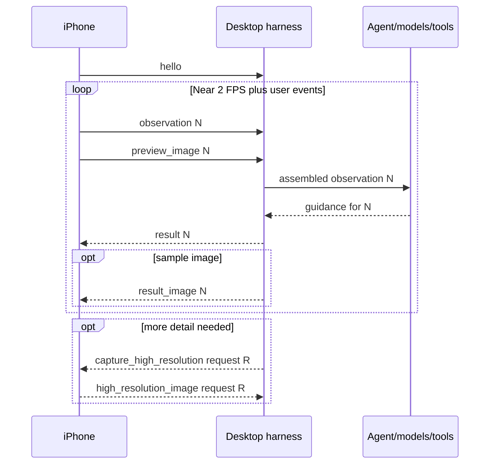

# Desktop Camera-Agent Integration Guide

This is the handoff for building the camera-agent harness, models, tools, state,
planning, and memory on Windows/WSL. The machine-readable source of truth is
[protocol-v1.schema.json](protocol-v1.schema.json). The concise transport
contract is [PROTOCOL.md](PROTOCOL.md), and
[mock_server/mock_camera_agent.py](mock_server/mock_camera_agent.py) is the
executable reference server.

## Ownership boundary

The iPhone is intentionally a dumb camera client. It owns:

- Camera permission, preview, focus, exposure, zoom, and capture
- User-entered shooting intention
- Observation/image encoding and WebSocket delivery
- Rendering guidance text, overlays, and a sample image
- Saving user-initiated full-quality photos
- Reconnect, client-side freshness checks, and capture rate limits

The desktop owns:

- Session/task state, planning, and memory
- Prompt construction, models, and tools
- Queueing, cancellation, and context selection
- Deciding whether a transient high-resolution still is needed
- Converting decisions to protocol-v1 results

The server cannot remotely change lens, zoom, focus, exposure, or trigger a
saved user photo. Its only camera command is a transient high-resolution still
request.

## Current client

The iOS 26 app provides a portrait-only 4:3 rear-camera preview, continuous
pinch zoom, tap focus/exposure, exposure bias, user shutter, intention editing,
approximately 2 FPS observation JPEGs, 1024 px network stills, optional motion
attitude, agent overlays/text/sample images, manual endpoint configuration, and
automatic reconnect.

Displayed zoom is capped at 0.5×–25×, but the available endpoints depend on the
selected iPhone's virtual camera. `zoomFactor` is the app's continuous displayed
scale; do not infer a particular physical lens from a numeric threshold. Virtual
camera constituent switching is controlled by AVFoundation/hardware.

There is no F-stop control or simulated aperture. There is also no video, front
camera, flash, RAW, manual ISO/shutter, background capture, discovery, TLS
pairing, or authentication.

## Lifecycle

The app builds and runs without a desktop server. Local camera controls remain
usable while offline.

1. The user enters a `ws://` or `wss://` URL and taps Connect.
2. After the socket opens, the client sends `hello` and waits for that send to
   complete.
3. Only then does it enable observation delivery.
4. If a preview exists, it sends a `reconnected` observation; routine frames
   then arrive near 2 FPS.
5. A disconnect does not stop the camera and does not create a replay buffer.
6. Retry delays are 1, 2, 4, 8, then at most 15 seconds.
7. Every reconnection begins again with `hello`.

The URL persists across app restarts. Intention and current camera state survive
a socket reconnect while the process lives, but intention is not persisted
after app termination. Protocol v1 has no device ID, authentication identity,
or resumable session token. Use one active phone per endpoint.

## Message flow and concurrency



The text frame for a specific observation is sent before its own binary image.
However, independent send tasks mean unrelated observation/image pairs may
interleave. A server must correlate IDs and must not assume the next binary
frame belongs to the most recent text frame. Likewise, send `result` before its
referenced `result_image`.

## Framing and validation

Connect to `/camera`. JSON uses WebSocket text frames. An image uses one binary
frame:

```text
bytes 0...3     unsigned 32-bit big-endian JSON-header length
next N bytes    UTF-8 JSON header
remaining bytes raw image payload
```

All known v1 objects are closed. Validate them against
[protocol-v1.schema.json](protocol-v1.schema.json) with Draft 2020-12 format
checking enabled. Reject unknown fields, wrong versions, malformed UUIDs,
invalid enum values, and bad overlay geometry. Unknown text-message types MUST be
ignored (and MAY be logged) for forward compatibility and protocol-v2 progressive
negotiation.

The iPhone applies the same strict policy to known server messages. If a result
contains one malformed overlay, the entire result is rejected—do not expect
partial rendering. The phone retains its previous valid guidance and emits:

```json
{
  "type": "error",
  "version": 1,
  "messageId": "77777777-7777-4777-8777-777777777777",
  "timestampMs": 1785123456789,
  "code": "invalid_message",
  "detail": "The agent sent an invalid overlay: point coordinates must be in 0...1."
}
```

Optional fields may be absent. Accept `null` only where the schema allows it.
Use an 8 MiB total-message cap or a similarly conservative limit. Validate the
four-byte header length before allocating or decoding.

## IDs and clocks

- `messageId`, `imageMessageId`, and `requestId` are UUID strings.
- `observationId` increases during one app process and continues across socket
  reconnects, but may reset after process restart.
- A new WebSocket is not proof of a new or returning physical device.
- `timestampMs` is Unix epoch milliseconds from the message creator.
- Phone/desktop clock synchronization is not required. Use IDs, arrival order,
  and desktop monotonic time for correctness.

## Client messages

### `hello`

First message on every connection:

```json
{
  "type": "hello",
  "version": 1,
  "messageId": "11111111-1111-4111-8111-111111111111",
  "client": "HelloCamera-iOS",
  "capabilities": [
    "preview_jpeg",
    "high_resolution_request",
    "overlay_primitives",
    "sample_image",
    "motion_attitude"
  ]
}
```

Treat capabilities as authoritative when evolving the server.

### `observation`

Sent for routine frames and meaningful events:

```json
{
  "type": "observation",
  "version": 1,
  "messageId": "22222222-2222-4222-8222-222222222222",
  "observationId": 42,
  "timestampMs": 1785123456789,
  "reason": "stream",
  "intention": "A confident full-body portrait at sunset",
  "camera": {
    "lensID": "com.apple.avfoundation.avcapturedevice.built-in_video:6",
    "lensName": "Back Camera",
    "zoomFactor": 1.0,
    "focalLength35mm": 24.0,
    "focusPoint": {"x": 0.48, "y": 0.42},
    "exposurePoint": {"x": 0.48, "y": 0.42},
    "exposureBias": 0.0,
    "iso": 64.0,
    "exposureDurationSeconds": 0.0083,
    "whiteBalanceRedGain": 2.1,
    "whiteBalanceGreenGain": 1.0,
    "whiteBalanceBlueGain": 1.7,
    "flashMode": "off",
    "orientation": "portrait",
    "frameWidth": 480,
    "frameHeight": 640,
    "cropAspectRatio": 0.75,
    "rollRadians": 0.01,
    "pitchRadians": -0.08
  },
  "imageMessageId": "33333333-3333-4333-8333-333333333333"
}
```

Reasons: `stream`, `reconnected`, `intention_updated`, `zoom_changed`,
`focus_changed`, `exposure_changed`, and `user_capture`. The confirmed intention
is repeated until updated.

Camera-field interpretation:

- `lensID` is the active constituent device's identity when available.
- `lensName` is AVFoundation's localized display name, not a stable enum.
- `zoomFactor` is the app's displayed continuous zoom scale.
- `focalLength35mm` is a nominal estimate calculated as `24 × zoomFactor`; it
  is not calibrated optics data and does not account for every physical
  constituent switch.
- `focusPoint` and `exposurePoint` are normalized AVFoundation device points,
  not overlay coordinates in the cropped JPEG.
- ISO, duration, white-balance gains, focus/exposure points, roll, and pitch may
  be absent when unavailable.
- Roll/pitch are radians useful for relative horizon guidance, not
  compass-referenced world coordinates.

The client retains contexts for roughly the latest 40 observations (about 20
seconds at the routine stream rate). Results referencing an evicted context are
ignored.

### `preview_image`

The corresponding binary header:

```json
{
  "type": "preview_image",
  "version": 1,
  "messageId": "33333333-3333-4333-8333-333333333333",
  "observationId": 42,
  "timestampMs": 1785123456789,
  "mimeType": "image/jpeg",
  "width": 480,
  "height": 640
}
```

The payload is the oriented, visible 4:3 preview crop, JPEG quality about 60%,
with maximum long edge 640 px. Agent overlay coordinates map directly to this
image.

### `high_resolution_image`

Agent-requested response:

```json
{
  "type": "high_resolution_image",
  "version": 1,
  "messageId": "44444444-4444-4444-8444-444444444444",
  "requestId": "55555555-5555-4555-8555-555555555555",
  "timestampMs": 1785123457000,
  "mimeType": "image/jpeg",
  "width": 768,
  "height": 1024,
  "initiation": "agent"
}
```

The JPEG derivative has maximum long edge 1024 px and quality about 85%.
Agent-initiated images are transient. For `initiation: "user"`, `requestId` is
absent and the full-quality original is also saved to Photos.

A user still follows a `user_capture` observation but has no strict ID-level
link to it in v1. Add such a link in v2 if it becomes necessary; do not infer it
from timing.

### `error`

Capture rejection example:

```json
{
  "type": "error",
  "version": 1,
  "messageId": "66666666-6666-4666-8666-666666666666",
  "timestampMs": 1785123457100,
  "requestId": "55555555-5555-4555-8555-555555555555",
  "code": "rate_limited",
  "detail": "High-resolution captures require a two-second interval."
}
```

`busy` and `rate_limited` carry the rejected request UUID.
`invalid_message` may omit `requestId`.

## Server messages

### `result`

Every result requires the envelope metadata and at least one content field:

```json
{
  "type": "result",
  "version": 1,
  "messageId": "88888888-8888-4888-8888-888888888888",
  "observationId": 42,
  "timestampMs": 1785123457200,
  "text": "Move the subject slightly left and keep the horizon level.",
  "overlays": [
    {
      "id": "move-left",
      "kind": "arrow",
      "points": [
        {"x": 0.70, "y": 0.54},
        {"x": 0.54, "y": 0.54}
      ],
      "color": "#62E6FF",
      "lineWidth": 4,
      "expiresInMilliseconds": 1800
    },
    {
      "id": "target",
      "kind": "rectangle",
      "points": [
        {"x": 0.18, "y": 0.28},
        {"x": 0.52, "y": 0.78}
      ],
      "color": "#FFD340",
      "lineWidth": 3,
      "expiresInMilliseconds": 2400
    }
  ],
  "imageMessageId": "99999999-9999-4999-8999-999999999999"
}
```

Overlay rules:

- `arrow`, `line`, `path`: at least two points
- `rectangle`, `circle`: exactly two opposing bounding corners
- `text`: exactly one anchor point and nonempty `text`
- All IDs in one result are unique and nonempty
- Coordinates are finite and in `0...1`
- Optional color is `#RRGGBB`
- Optional line width and expiry are positive

Result merge/freshness behavior:

- A lower `observationId` than the latest accepted result is ignored.
- Equal IDs are permitted, enabling incremental content updates.
- A missing `text` leaves the displayed text unchanged.
- A missing `overlays` clears current overlays.
- A missing/new `imageMessageId` cancels the previously pending image transfer,
  while the last successfully displayed sample image remains.
- Spatial overlays require a source context no older than two seconds and
  matching lens, zoom (0.001 precision), orientation, dimensions, and crop.
- A user zoom change clears overlays immediately.
- Each overlay expires independently; one short-lived overlay does not remove
  longer-lived siblings.

Prefer low-latency guidance and cancel superseded routine inference.

### `result_image`

Send after the result that references it:

```json
{
  "type": "result_image",
  "version": 1,
  "messageId": "99999999-9999-4999-8999-999999999999",
  "observationId": 42,
  "timestampMs": 1785123457200,
  "mimeType": "image/png",
  "width": 360,
  "height": 240
}
```

The payload may be JPEG or PNG. Both `messageId` and `observationId` must match
the client's currently pending sample-image reference. An unmatched or delayed
image is dropped.

### `capture_high_resolution`

```json
{
  "type": "capture_high_resolution",
  "version": 1,
  "requestId": "55555555-5555-4555-8555-555555555555"
}
```

Use a new UUID and wait for a matching image or error. The phone allows at most
one capture at a time and at least two seconds between agent requests. A
five-second desktop timeout is reasonable. Cancel the request context on socket
disconnect; never replay its UUID after reconnect.

## Long-running model work

The following are some thoughts, not protocol requirements. While a VLM or image
editing model is working, the harness can continue receiving observations and
retain only the newest routine frame waiting for analysis. The iPhone keeps
showing its previous guidance while it waits, although overlays may expire.

Before returning a slow result, consider whether the scene and shooting
intention are still relevant; stale work can be discarded or restarted from a
newer observation. For a generated example image, send its `result` first and
then the correlated `result_image`.

Again, these are just some basic thoughts. You can definitely have your own better ideas.

## Recommended harness shape

Keep transport concerns outside the agent runtime:

1. **WebSocket adapter**
   - Validate text and binary headers against the schema.
   - Decode the binary envelope and enforce size limits.
   - Track connection-local request state.
2. **Observation assembler**
   - Join metadata and JPEG using both `imageMessageId` and `observationId`.
   - Bound unmatched entries and expire them.
   - Normalize into the harness's internal observation type.
3. **Freshness scheduler**
   - Process at most one routine stream inference at a time.
   - Retain only the newest waiting stream observation.
   - Prioritize intention, camera-control, capture, and still-image events.
4. **Agent runtime**
   - Own plan, memory, models, prompts, and tools.
   - Decide whether current evidence is sufficient.
5. **Result adapter**
   - Produce concise text, normalized primitives, and optional image bytes.
   - Preserve the source `observationId`.
   - Validate outgoing messages before transmission.

Never grow an unbounded 2 FPS queue. Also bound unmatched observation metadata,
images, pending still requests, and logs containing image data.

## Reference server and tests

The repository includes:

- `mock_server/mock_camera_agent.py`: validated WebSocket server/result fixture
- `mock_server/protocol_schema.py`: Draft 2020-12 validator helper
- `mock_server/wire_protocol.py`: binary envelope helpers
- `mock_server/test_schema.py`: schema/semantic validation tests
- `mock_server/test_protocol.py`: framing tests
- `mock_server/test_integration.py`: full socket round trip
- `mock_server/requirements.txt`: pinned dependencies

Run:

```bash
python3 -m venv mock_server/.venv
source mock_server/.venv/bin/activate
python3 -m pip install -r mock_server/requirements.txt
python3 -m unittest \
  mock_server.test_protocol \
  mock_server.test_schema \
  mock_server.test_integration
python3 mock_server/mock_camera_agent.py
```

Bind to `0.0.0.0`, serve `/camera`, and use the printed LAN-accessible address.
Windows Firewall/WSL routing instructions are in [README.md](README.md).

## Security before distribution

Protocol v1 currently permits plaintext `ws://`. Images, intention text, and
metadata are visible to anyone able to inspect that network. Use a trusted
private Wi-Fi network or private Windows hotspot only.

Before distribution, add `wss://`, authentication, phone/desktop pairing,
certificate trust management, and explicit desktop retention controls.
