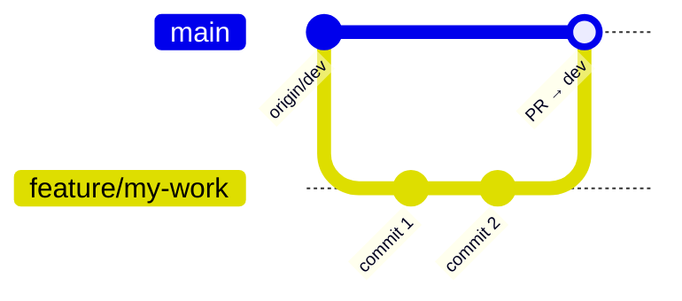

# Camera Agent 日常开发工作流

本文档说明基于团队代码仓 [MTI-camera-agent/camera_agent](https://github.com/MTI-camera-agent/camera_agent) `dev` 分支的日常开发、环境管理与提交流程。

---

## 1. 仓库与本地目录

| 项目 | 值 |
|------|-----|
| 远程仓库 | `https://github.com/MTI-camera-agent/camera_agent.git` |
| 集成分支 | `dev` |
| 本地路径 | `/home/pathfinder/projects/CameraAgent` |
| 当前跟踪分支 | `dev`（已与 `origin/dev` 关联） |

### 本地备份（克隆前保留的资料）

克隆时已将以下内容移到项目外，**不会进入 Git 跟踪**：

| 原路径 | 备份位置 |
|--------|----------|
| `docs_ori/` | `/home/pathfinder/projects/CameraAgent-docs_ori-backup` |
| `reference/` | `/home/pathfinder/projects/CameraAgent-reference-backup` |

需要时手动对比合并；`reference/` 建议继续放在仓库外作本地参考。

---

## 2. 环境隔离原则（WSL2）

### 为何单独建环境

本机已有多个 conda 环境（`memory_graph_env`、`minicpmo`、`mm-comfyui`、`qwen3vl-fp8` 等）。**禁止在 `base` 或其他项目环境中直接 `pip install`**，避免依赖冲突。

Camera Agent 使用独立环境：

```text
conda env: camera_agent
Python:    3.12
路径:      ~/miniconda3/envs/camera_agent
```

相关推理环境（**隔离，勿混装**）：

| 环境 | 用途 | CameraAgent 是否可改 |
|------|------|----------------------|
| `camera_agent` | 业务 Agent / 单测 | 可（本仓维护） |
| `qwen3vl-fp8` | Qwen3-VL FP8 + vLLM `:8000`；同 env 跑 MiniCPM `transformers serve` `:8001` | 可（本仓 VLM 栈；**勿升 vLLM** 冒进） |
| `mm-comfyui` | ComfyUI 图像主栈 `:8188` | **禁止随意更改**（见 §3.5） |
| Omni / FLUX 所用 env | `:8010` 冷备选 | 仅应急；默认不启 |

### 硬件与 GPU 注意

| 项目 | 说明 |
|------|------|
| 运行环境 | WSL2 (linux 6.6.x) |
| GPU | NVIDIA GeForce RTX 5090，驱动 591.x，CUDA 13.x |
| 显存 | 约 24 GB；**默认三服务**可能叠满，必要时串行：先理解/评估再出图 |

**建议：**

- **日常开发与单元测试**：使用 `requirements.txt` 轻量环境即可。
- **默认本地推理服务（3 个）**：
  1. VLM：`qwen3vl-fp8` + `scripts/start_qwen3vl_server.sh` → `:8000`（planner `vision_bridge`；启动前会幂等执行 `patch_vllm_qwen3vl_deepstack.sh`）
  2. 评估：同 env + `scripts/start_minicpm_server.sh` → `:8001`（Reflector MiniCPM-V-4.6）
  3. 图像主栈：已有 `mm-comfyui` + `scripts/start_comfyui_server.sh` → `:8188`（Qwen2511）
- **FLUX `:8010`（冷备选）**：仅 ComfyUI 不可用时临时 `scripts/start_flux_server.sh`；用完即停。详见 [flux_vllm_omni_service.md](flux_vllm_omni_service.md)。
- 可通过 `CUDA_VISIBLE_DEVICES=0` 显式指定 GPU。

### 镜像源（国内网络）

安装脚本与手动命令均使用清华镜像，**不修改全局** `~/.condarc` / `pip.conf`：

| 用途 | 地址 |
|------|------|
| Conda main | `https://mirrors.tuna.tsinghua.edu.cn/anaconda/pkgs/main` |
| Conda forge | `https://mirrors.tuna.tsinghua.edu.cn/anaconda/cloud/conda-forge` |
| pip | `https://pypi.tuna.tsinghua.edu.cn/simple` |

参考：[清华大学开源软件镜像站 — PyPI](https://pypi.tuna.tsinghua.edu.cn/simple)

---

## 3. 环境安装

### 3.1 一键安装（推荐）

```bash
cd /home/pathfinder/projects/CameraAgent
bash scripts/setup_dev_env.sh
conda activate camera_agent
pytest -q
```

### 3.2 手动安装

```bash
conda create -n camera_agent python=3.12 -y \
  -c https://mirrors.tuna.tsinghua.edu.cn/anaconda/pkgs/main \
  -c https://mirrors.tuna.tsinghua.edu.cn/anaconda/cloud/conda-forge

conda activate camera_agent

pip install -r requirements.txt \
  -i https://pypi.tuna.tsinghua.edu.cn/simple \
  --trusted-host pypi.tuna.tsinghua.edu.cn
```

### 3.3 可选：完整 GPU / FLUX 冷备选栈

仅在 **ComfyUI 不可用、需要 FLUX fallback** 时安装/启动（体积大、占 GPU；**默认不启**）：

```bash
conda activate camera_agent

# 方式 A：按仓库 environment.yml（含 PyTorch、vllm-omni 等）
conda env update -n camera_agent -f environment.yml \
  -c https://mirrors.tuna.tsinghua.edu.cn/anaconda/cloud/conda-forge

export MODEL_PATH=/path/to/FLUX.2-klein-4B
bash scripts/start_flux_server.sh   # :8010 冷备选
```

### 3.4 运行时环境变量

```bash
# Planner：DeepSeek（config.yaml structured_vision）
export DEEPSEEK_API_KEY="your-key"
# DeepSeek Chat API 不接受 image_url：需本地 Qwen3-VL 作 vision_bridge（:8000）
# bash scripts/start_qwen3vl_server.sh

# Reflector 双图评估：本地 MiniCPM-V-4.6（config.yaml structured_evaluation → :8001）
# bash scripts/start_minicpm_server.sh
# 详见 docs/minicpm_evaluation.md；本地无需 MINICPM_API_KEY
# 自检：python scripts/probe_minicpm_api.py
#
# 冷备选公开 API（试用 key 曾失败 lis_route_denied；仅正式 key 时启用）：
# export MINICPM_API_KEY="your-key"
# python scripts/probe_minicpm_api.py --base-url https://api.modelbest.co/v1 --api-key-env MINICPM_API_KEY

# 默认图像主栈 = ComfyUI（见 config.yaml provider: comfyui）
# export COMFYUI_BASE_URL=http://127.0.0.1:8188

# 冷备选 FLUX（仅临时）
# export IMAGE_SERVICE_BASE_URL=http://127.0.0.1:8010
```

密钥写入 `~/.bashrc` 或项目根目录 `.env`（已在 `.gitignore` 中忽略，**勿提交**）。

应用日志默认：终端 `WARNING+`；详细 HTTP 写入 `outputs/logs/camera_agent.log`（见 `config.yaml` `logging`）。启停脚本默认安静等待，`VERBOSE=1` 可恢复逐秒打印。

### 3.5 mm-comfyui / ComfyUI 生成服务（硬约束）

#### 不得随意更改 `mm-comfyui`

**CameraAgent 项目不得随意更改 `mm-comfyui` conda 环境。**

- 禁止为本仓任务在该 env 内擅自 `pip install` / `pip uninstall` / `conda install` / 改 ComfyUI 核心依赖或全局配置。
- CameraAgent **只通过 HTTP API**（默认 `http://127.0.0.1:8188`）调用已有 ComfyUI。
- 本仓脚本与 `requirements.txt` **不得**把依赖装进 `mm-comfyui`。
- 确需变更（新节点、新包）：在 ComfyUI / mm 侧单独评审与维护，**禁止**夹带在 CameraAgent PR 里 silently 改环境。

#### 环境与路径约定

| 项 | 约定 |
|----|------|
| conda | `conda activate mm-comfyui`（仅运维启停用；业务代码用 `camera_agent`） |
| 默认端口 | `8188` |
| 探活 | `GET http://127.0.0.1:8188/system_stats` |
| 权重 | 优先 `/mnt/ssd-models`；本机亦可由 ComfyUI `extra_model_paths` 指向共享库（如 `/home/pathfinder/business/models`）——**由 mm 侧维护，CameraAgent 只读约定** |
| 启停 | `scripts/start_comfyui_server.sh` / `stop_comfyui_server.sh` / `status_comfyui_server.sh`（委托已有 ComfyUI 启动器，不改 env） |
| 与 VLM | `qwen3vl-fp8` 独立；24GB 上与 Qwen/MiniCPM/ComfyUI 可能需**串行** |

#### 默认启停清单

| 服务 | 端口 | 默认 |
|------|------|------|
| Qwen3-VL vLLM | 8000 | 启（planner vision_bridge） |
| MiniCPM-V-4.6 | 8001 | 启（Reflector 双图评估） |
| ComfyUI | 8188 | 启（示意图主路径） |
| FLUX vLLM-Omni | 8010 | **不启**（冷备选） |

一键启停默认三服务（`:8000` + `:8001` + `:8188`；不含 FLUX）：

```bash
bash scripts/restart_required_services.sh          # stop → start → status
bash scripts/restart_required_services.sh status
bash scripts/restart_required_services.sh stop
bash scripts/restart_required_services.sh start
```

跑通流水线：

```bash
# 1) 默认三服务栈
bash scripts/restart_required_services.sh

# 2) instruction / agent（需 DEEPSEEK_API_KEY；vision_bridge :8000；评估 :8001）
python scripts/test_qwen3vl.py

# 3) 若显存紧：可只停其一后串行
# bash scripts/stop_qwen3vl_server.sh
# bash scripts/stop_minicpm_server.sh
# bash scripts/start_comfyui_server.sh

# 4) instruction → 示意图
python scripts/vlm_edit_qwen3vl_qwen2511.py \
  --image test_img/input_frame.png \
  --edited-dir outputs/reference_previews
```

---

## 4. 日常 Git 工作流

**原则：不在 `dev` 上直接开发；从 `dev` 拉功能分支，通过 PR 合并。**



### 4.1 开始新任务前：同步 dev

```bash
cd /home/pathfinder/projects/CameraAgent
conda activate camera_agent

git checkout dev
git pull origin dev
```

### 4.2 创建功能分支

分支命名建议：`feature/<简述>`、`fix/<简述>`、`docs/<简述>`。

```bash
git checkout -b feature/your-feature-name
```

### 4.3 开发与自测

```bash
# 单元测试
pytest

# 本地跑 agent（需 DEEPSEEK_API_KEY + 图像服务）
python app.py \
  --image test_img/stand_female_0.jpg \
  --prompt "Change the background to a sunny beach while preserving the person."
```

### 4.4 提交

```bash
git status
git add <files>
git commit -m "feat: 简短描述改动原因"
```

提交信息风格与仓库保持一致：`feat:` / `fix:` / `docs:` / `refactor:` 等。

### 4.5 推送到远程

```bash
# 首次推送该分支
git push -u origin feature/your-feature-name

# 后续
git push
```

### 4.6 创建 Pull Request（合并到 dev）

```bash
gh pr create --base dev --head feature/your-feature-name \
  --title "PR 标题" \
  --body "$(cat <<'EOF'
## Summary
- 改动说明

## Test plan
- [ ] pytest 通过
- [ ] 手动验证 app.py（如适用）
EOF
)"
```

或在 GitHub 网页：Compare `feature/...` → base `dev`。

### 4.7 合并后清理

```bash
git checkout dev
git pull origin dev
git branch -d feature/your-feature-name
```

---

## 5. 常用命令速查

| 场景 | 命令 |
|------|------|
| 激活环境 | `conda activate camera_agent` |
| 跑测试 | `pytest` |
| 跑 live 集成测试 | `RUN_LIVE_AGENT_TESTS=1 pytest tests/test_live_integration.py -q -s` |
| 查看 GPU | `nvidia-smi` |
| 启动 FLUX | `MODEL_PATH=... bash scripts/start_flux_server.sh` |
| 停止 FLUX | `bash scripts/stop_flux_server.sh` |
| 同步 dev | `git checkout dev && git pull origin dev` |

---

## 6. 输出目录

运行 `app.py` 后生成内容在 `outputs/`（已 gitignore）：

- `outputs/plans` — 计划
- `outputs/logs` — 状态快照
- `outputs/masks` — 掩码
- `outputs/images` — 最终图像

---

## 7. 与团队文档的关系

- 仓库架构与模块说明：[docs/project_guide.md](project_guide.md)
- 团队方案选型、ADR 等历史文档在本地备份：`/home/pathfinder/projects/CameraAgent-docs_ori-backup`
- 技术选型刷新后，再更新本仓库配置与本文档对应章节

---

## 8. 故障排查

| 问题 | 处理 |
|------|------|
| `pip install` 卡住 | 确认使用 `-i https://pypi.tuna.tsinghua.edu.cn/simple` |
| `nvidia-smi` 在沙箱/受限环境失败 | 在 WSL 正常终端执行；确保 Windows 侧 NVIDIA 驱动与 WSL CUDA 正常 |
| GPU 显存不足 | 先停 VLM / MiniCPM / ComfyUI（串行）；**勿**再叠 FLUX；或只跑不依赖本地 GPU 的测试 |
| `DEEPSEEK_API_KEY` 未设置 | `export DEEPSEEK_API_KEY=...` 后再运行 `app.py` |
| Planning `Request timed out` | 查 DeepSeek 网络（`curl https://api.deepseek.com`），非 MiniCPM；见 `structured_vision.timeout_seconds` |
| Vision bridge HTTP 500 / `EngineDead` / `deepstack` | vLLM 0.20.x Qwen3-VL 已知 bug：`bash scripts/patch_vllm_qwen3vl_deepstack.sh` 后 `bash scripts/restart_required_services.sh`（`:8000` 已死必须重启） |
| MiniCPM `:8001` 未就绪 | `bash scripts/status_minicpm_server.sh`；`bash scripts/start_minicpm_server.sh` |
| Evaluation `non-JSON` / Agno str | `transformers serve` 忽略 `response_format`；见 `docs/minicpm_evaluation.md` 与 `prompts/reflection.md` |
| `/v1/models` 不是 MiniCPM | 正常：列表扫 HF cache；`force_model` 仍是 `MiniCPM-V-4.6` |
| 公开 API `MINICPM_API_KEY` / `lis_route_denied` | 默认已切本地；冷备选见 `docs/minicpm_evaluation.md`；`python scripts/probe_minicpm_api.py` |
| 图像服务连接失败 | 确认 ComfyUI：`curl http://127.0.0.1:8188/system_stats`；冷备选 FLUX：`curl http://127.0.0.1:8010/health` |
