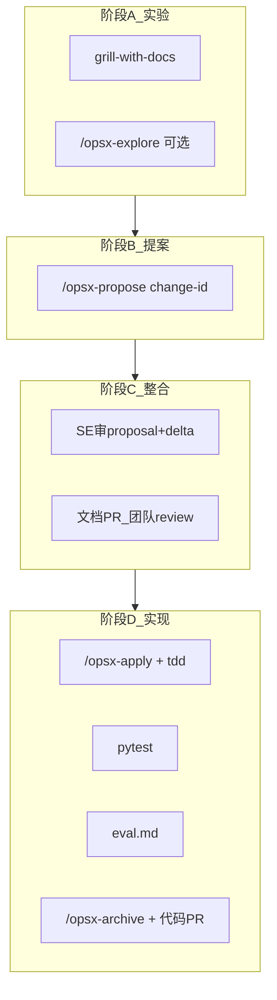

# CameraAgent：协作与规格驱动说明书

- **版本**：v1.0
- **日期**：2026-08-13
- **状态**：Active — **团队日常操作手册**（必读）
- **读者**：SE / Harness / Model / Skills / Mobile 全体开发者
- **关联**：
  - 调研与选型依据：[协作与规格驱动工作流调研.md](协作与规格驱动工作流调研.md)
  - 产品里程碑：[01-MVP期-方案设计及计划.md](01-MVP期-方案设计及计划.md)
  - P3 执行切片：[p3_act_channels.md](p3_act_channels.md)
  - 代码规范：[../AGENTS.md](../AGENTS.md)
  - 环境与 GPU：[development_workflow.md](development_workflow.md)

---

## 1. 本说明书解决什么问题

CameraAgent 采用 **Spec-Driven Development（SDD）+ 四角色分工 + 主责 SE 合流**：

1. 各成员在各自 lane **先对齐、再写规格**（实验期不写生产代码）。
2. 规格以 **OpenSpec change 包** 进 Git，经 SE 整合评审后 **统一 apply**。
3. 实现对照 delta spec 验收，PR 合 `dev`，archive 更新行为真相。

**核心原则**：文档加速对齐 ≠ 弱化 Git。规格与代码**同仓版本化**；瓶颈在评审合流，不在 `git push`。

---

## 2. 已交付脚手架（仓库内清单）

以下文件/目录已在业务仓就绪，新成员 clone 即可用（**重启 Cursor** 后加载 slash 命令）。

| 路径 | 用途 |
|------|------|
| [`openspec/config.yaml`](../openspec/config.yaml) | OpenSpec 项目 context 与 artifact 规则 |
| [`openspec/specs/`](../openspec/specs/) | 当前系统行为 spec（archive 后累积） |
| [`openspec/changes/`](../openspec/changes/) | 进行中变更包 |
| [`.cursor/commands/opsx-*.md`](../.cursor/commands/) | Cursor：`/opsx-explore` `/opsx-propose` `/opsx-apply` `/opsx-archive` |
| [`.cursor/skills/openspec-*`](../.cursor/skills/) | OpenSpec 工作流技能 |
| [`.cursor/skills/`](../.cursor/skills/) 下 Pocock 精选 | `grill-with-docs`、`tdd`、`code-review` 等 |
| [`CONTEXT.md`](../CONTEXT.md) | 项目术语表（glossary） |
| [`docs/adr/`](../docs/adr/) | 架构决策记录（ADR） |
| [`.github/pull_request_template.md`](../.github/pull_request_template.md) | PR 模板（链 openspec change） |
| [`reference/skills`](../reference/skills) | mattpocock/skills 只读镜像 @ `84fdeff` |
| [`reference/openspec`](../reference/openspec) | OpenSpec 上游只读镜像 @ `610b78f` |
| [`reference/README.md`](../reference/README.md) | 镜像更新说明 |

**尚未自动生成、需团队按流程创建的内容**：

- 首个 change：`p3-schema-lock`（SE 发起）
- 各 lane 的 `openspec/changes/<id>/` 变更包
- `docs/adr/NNNN-*.md` 具体 ADR 文件
- GitHub Issues（按 `[openspec:<id>]` 命名）

---

## 3. 工具栈与分工（不二选一）

```text
OpenSpec      → WHAT：openspec/changes/ 变更包、delta spec、tasks、archive
Pocock grill  → WHY：grill-with-docs 访谈、CONTEXT.md、ADR（propose 之前）
Pocock tdd    → HOW 可靠：apply 阶段红绿重构
Pocock review → DONE：PR 前 Standards × Spec 双轴评审
Git + PR      → SoT：规格与代码同仓；SE 唯一 merge 生产代码
docs/01       → 里程碑 M1–M5（archive 时 SE 人工勾选）
```

| 层 | 工具 | 禁止替代 |
|----|------|----------|
| 变更规格 | OpenSpec | Notion/飞书作唯一 SoT |
| Agent 纪律 | mattpocock 精选 skills | skills 替代 Code Review |
| 人协作 | GitHub Issues + PR | 并行 `*_v2` 实现分叉 |

---

## 4. 文档分层规范（必读，防打架）

| 文档 | 写什么 | 不写什么 | 谁维护 |
|------|--------|----------|--------|
| [`CONTEXT.md`](../CONTEXT.md) | 术语定义、Avoid 同义词 | 实现细节、验收标准 | 全员（grill-with-docs 触发更新） |
| [`docs/adr/`](../docs/adr/) | 难逆转、有权衡的决策 | 功能 spec、任务列表 | 提案人 + SE 审 |
| `openspec/specs/<domain>/` | 当前行为：SHALL + Scenario | 进行中未 archive 的草案 | archive 自动合入 |
| `openspec/changes/<id>/` | proposal、delta、design、tasks、eval | — | change 主责 propose；SE 整合 |
| [`docs/01-…`](01-MVP期-方案设计及计划.md) | 阶段目标、M 验收清单 | 单次 PR 细节 | SE（archive 后勾选） |
| [`docs/p3_*`](p3_act_channels.md) | PR 切片与通道设计 | — | SE + lane 主责 |
| [`docs/02`](02-框架及流程图.md)、[`03`](03-场景设计及Skills实现.md) | 设计参考 | 不阻塞日常 PR | 独立维护，落地后 SE 择要回写 01 |
| 飞书/Notion | 草稿、会议笔记 | **定稿必须 7 天内进 Git** | 个人 |

**OpenSpec delta 写法**（变更 spec 内）：

```markdown
## ADDED Requirements

### Requirement: Reference preview status
The gateway SHALL expose reference preview status on the session API.

#### Scenario: Confirm intent kicks off generation
- **WHEN** the client confirms intent
- **THEN** reference preview status is `generating` until PNG is ready
```

---

## 5. 角色定义与边界

| 角色 | 代号 | 负责 | 禁止 |
|------|------|------|------|
| **方案与统一实现负责人** | **SE** | Schema/API 锁、change **整合批准**、**唯一 merge 生产代码**、gateway/mobile 契约 | 长期独占模型运维；并行多套实现 |
| **Agent Harness** | **Harness** | `workflow/` loop、SkillRegistry、Memory、Wiki | 改 vLLM/ComfyUI 权重；单独定里程碑 |
| **模型优化** | **Model** | vLLM/ComfyUI 脚本、Qwen3.5 统一 Agent、FP8/评测 | agent 内 GPU 调度；改 gateway 业务 |
| **Skills 实现** | **Skills** | `skills/*.py`、CV/示意图 skill、单测 | 绕过 factory 硬编码 provider |
| （可选）**Mobile** | **Mobile** | `mobile/` Expo、Channel B overlay | 自定 API 契约（须 SE/Skills 锁） |

**Harness vs Skills**：Harness = 怎么编排、注册、loop；Skills = 可替换能力单元（如 `Qwen3VLPhotoClient`）。

### 5.1 推荐编制（4 人）

| 成员 | 角色 | 当前 Sprint 重点 |
|------|------|------------------|
| A | **SE** | 整合、schema 锁、PR merge、`docs/01` 勾选 |
| B | Harness | SkillRegistry + shooting act loop |
| C | Model | 服务栈 + Qwen3.5 unified agent change |
| D | Skills + Mobile | PR1/PR2 skills + `mobile/` Phase C |

---

## 6. 四阶段协作流程（操作手册）



### 阶段 A — 模块实验

**参与者**：Skills / Harness / Model 各 lane  
**门禁**：**禁止 merge 生产代码 PR**

| 步骤 | 操作 |
|------|------|
| 1 | 阅读 [`p3_act_channels.md`](p3_act_channels.md) 与相关模块代码 |
| 2 | Cursor 中触发 **`grill-with-docs`**（纯产品议题用 `grill-me`） |
| 3 | 可选：`/opsx-explore` 让 Agent 读仓、画架构（**不写代码**） |
| 4 | 术语草案写入 [`CONTEXT.md`](../CONTEXT.md)；硬决策考虑 ADR |

**grill 结束标准**：Agent 复述 shared understanding，**你确认前不得改代码**。

### 阶段 B — OpenSpec 提案

**参与者**：各 lane 主责  
**门禁**：`/opsx-propose` **仅生成规划 artifact，禁止写业务代码**

```text
/opsx-propose p3-pr2-coarse-act-cv
```

生成目录示例：

```text
openspec/changes/p3-pr2-coarse-act-cv/
├── proposal.md      # 为什么做、做什么
├── design.md        # 怎么做（模块、接口）
├── tasks.md         # 可勾选实现步骤
└── specs/
    └── gateway-act/spec.md   # delta：ADDED/MODIFIED/REMOVED
```

**CLI 辅助**（终端，可选）：

```bash
cd /home/pathfinder/projects/CameraAgent
openspec list                    # 列出进行中 change
openspec status --change p3-pr2-coarse-act-cv
openspec doctor                  # 检查 openspec 根是否正常
```

### 阶段 C — SE 整合评审

**参与者**：**SE 主责** + 全员  
**门禁**：**未 SE 批准，不得 `/opsx-apply`**

| 步骤 | SE 操作 |
|------|---------|
| 1 | 收集各 lane 的 `openspec/changes/<id>/` |
| 2 | 检查冲突：同一文件/API 是否被多个 change 修改 |
| 3 | 冲突时：合并为一个 change，或排期串行 apply |
| 4 | 开 **仅文档 PR**（或 change 文件夹 PR），团队 review proposal + delta + tasks |
| 5 | 会议过验收 Scenario；记录批准列表 |

### 阶段 D — 统一实现与评估

**参与者**：SE 指定的 implementer（通常该 lane 主责）+ Agent  
**门禁**：PR 必须链接 change id；SE merge

| 步骤 | 操作 |
|------|------|
| 1 | `/opsx-apply` 按 `tasks.md` 实现；配合 **`tdd`** skill |
| 2 | `pytest -q`（涉及 live 时见 [development_workflow.md](development_workflow.md)） |
| 3 | 写 **`eval.md`**（或在 PR 体）：对照 spec Scenario，记差距 |
| 4 | PR 前 **`code-review`**（Standards × Spec） |
| 5 | `/opsx-archive`；代码 PR 合 `dev` |
| 6 | **SE**：若里程碑达成，更新 [`docs/01`](01-MVP期-方案设计及计划.md) §8 验收勾选 |

---

## 7. 指令说明（Cursor / CLI）

### 7.1 Cursor Slash 命令（OpenSpec）

| 命令 | 阶段 | 行为 |
|------|------|------|
| `/opsx-explore` | A | 读仓、讨论方案；**不写业务代码** |
| `/opsx-propose <change-id>` | B | 创建 change 目录 + 全套 artifact；**不写业务代码** |
| `/opsx-apply` | D | 按 tasks 实现（需 SE 已批准） |
| `/opsx-archive` | D 末 | delta 合入 `openspec/specs/`；change 移入 archive |

> 若命令未出现：**重启 Cursor**（`openspec init` 写入 `.cursor/commands/`）。

### 7.2 Cursor Skills（Pocock 精选）

路径：[`.cursor/skills/`](../.cursor/skills/)。在 Agent 对话中 **显式引用** skill 名或 `@` 对应 `SKILL.md`。

| Skill | 何时用 | 触发方式 |
|-------|--------|----------|
| `grill-with-docs` | 模块实验、方案澄清 | **用户显式**（默认） |
| `grill-me` | 纯产品/非代码议题 | 用户显式 |
| `research` | 需要带引用的调研 md | 用户显式 |
| `tdd` | apply 实现 | apply 阶段 |
| `code-review` | PR 前 | 用户显式 |

`grilling`、`domain-modeling` 由 grill-* 内部委托，通常无需单独调用。

### 7.3 OpenSpec CLI

```bash
# 安装（一次性，Node ≥ 20.19）
npm install -g @fission-ai/openspec@latest

# 已在业务仓 init；新 clone 后验证
cd /home/pathfinder/projects/CameraAgent
openspec doctor
openspec update          # 升级后刷新 .cursor 指令

# 常用
openspec list
openspec list --specs
openspec status --change <change-id>
openspec archive <change-id>   # 也可在 Cursor 用 /opsx-archive
```

### 7.4 同步 Pocock 精选技能（维护）

上游更新后，由 SE 或当值维护者执行：

```bash
cd /home/pathfinder/projects/CameraAgent
cd reference/skills && git pull && cd ../..
SRC=reference/skills/skills
DST=.cursor/skills
for s in productivity/grill-me productivity/grilling engineering/grill-with-docs \
         engineering/domain-modeling engineering/tdd engineering/code-review engineering/research; do
  name=$(basename "$s")
  rm -rf "$DST/$name"
  cp -r "$SRC/$s" "$DST/$name"
done
cp reference/skills/skills/engineering/domain-modeling/*.md .cursor/skills/domain-modeling/
```

记录新 commit 到 [`reference/README.md`](../reference/README.md)。

---

## 8. Git / Issue / PR 规范

### 8.1 分支

| 类型 | 命名 | 是否 merge |
|------|------|------------|
| 功能/规格 | `feat/<change-id>` 或 `docs/<change-id>` | 是（经 SE） |
| 实验 spike | `spike/<owner>/<topic>` | **否**（有价值则重开 OpenSpec change） |
| 集成主干 | `dev` | — |

### 8.2 Issue

```
[openspec:p3-pr2-coarse-act-cv] 实现粗调 CV 四 skill + analyze-frame
```

### 8.3 PR

**标题**：

```
feat(p3): coarse act CV skills (openspec: p3-pr2-coarse-act-cv)
```

**正文**：使用 [`.github/pull_request_template.md`](../.github/pull_request_template.md)，必填：

- `openspec/changes/<id>/` 链接
- tasks 勾选情况
- eval 摘要
- `pytest` 结果

### 8.4 Commit

遵循 [development_workflow.md](development_workflow.md)：`feat:` / `fix:` / `docs:` 等；一次 apply 内按 task 原子提交更佳（便于 bisect）。

---

## 9. 任务地图（OpenSpec change id）

与 [p3_act_channels.md](p3_act_channels.md) 对齐。并行 propose 前，**SE 必须先完成** `p3-schema-lock`。

| change id | 主责 | 协作 | 优先级 | 主要路径 |
|-----------|------|------|--------|----------|
| `p3-schema-lock` | SE | 全员 | **P0** | `schemas/shooting.py`、analyze-frame 契约 |
| `p3-pr1-reference-preview` | Skills | Model, SE | **P0** | `skills/reference_image.py`、`services/gateway/reference_preview.py` |
| `p3-pr2-coarse-act-cv` | Skills | Harness, SE, Mobile | **P0** | 四 CV skill、`ShootingLoop.analyze_frame`、`mobile/` |
| `harness-skill-registry` | Harness | SE | P1 | `skills/registry.py`、`models/factory.py` |
| `harness-shooting-act-loop` | Harness | SE, Skills | P1 | `workflow/shooting_loop.py` |
| `model-qwen35-unified-agent` | Model | Harness, SE | P1 | 收敛主 Agent 至 Qwen3.5-9B |
| `harness-memory-episodic` | Harness | SE | P2 | `memory/` |
| `harness-wiki-reference` | Harness | Skills | P2 | Wiki 新模块 |
| `p4-minicpm-fine-act` | Skills | Model, Harness | P3 | `agents/coach.py`、精调环 |

**并行规则**：PR1 与 PR2 可并行 **propose**；**apply** 建议串行：PR1 测通 → PR2 → registry。

---

## 10. 团队落地待办（适应本流程还需做什么）

### 10.1 全员（Day 1）

- [ ] 阅读本说明书 + [`AGENTS.md`](../AGENTS.md)
- [ ] 安装 OpenSpec CLI：`npm i -g @fission-ai/openspec`
- [ ] 重启 Cursor，确认 `/opsx-propose` 可用
- [ ] 跑通：`openspec doctor`

### 10.2 SE（Day 1–2）

- [ ] 确认 [`openspec/config.yaml`](../openspec/config.yaml) 与项目一致（已注入 01/p3/AGENTS 指针）
- [ ] 发起 **`/opsx-propose p3-schema-lock`** → 30min 评审 → apply
- [ ] 建立 Issue 模板习惯（`[openspec:…]`）
- [ ] 指定各 lane 主责与当前 Sprint change id

### 10.3 各 Lane（Day 3–5）

- [ ] 对本 lane 议题跑 **`grill-with-docs`**
- [ ] **`/opsx-propose <change-id>`** 提交完整 artifact
- [ ] **不** 提交生产代码 PR

### 10.4 SE 整合（Day 6）

- [ ] 文档 PR：合并/批准各 change proposal
- [ ] 发布「可 apply 顺序」与负责人

### 10.5 实现周（Week 2+）

- [ ] 按顺序 `/opsx-apply` + `tdd` + `pytest`
- [ ] 每 change：`eval.md` → `/opsx-archive` → 代码 PR → SE merge
- [ ] archive 后更新 `docs/01` 里程碑勾选

### 10.6 可选后续增强

- [ ] 跑一轮 grill 样例会话，填 §11 Rubric 实测表
- [ ] GitHub Issue 模板（`.github/ISSUE_TEMPLATE/`）
- [ ] CI 检查 PR 是否提及 openspec change id
- [ ] 从 backup 迁回历史 ADR 至 `docs/adr/`

---

## 11. 质量门禁与 Rubric

### 11.1 阶段门禁（摘要）

| 阶段 | 硬门禁 |
|------|--------|
| A 实验 | 无生产代码 merge |
| B 提案 | propose 不写代码 |
| C 整合 | 无 SE 批准不 apply |
| D 实现 | PR 链 change id；pytest 过；无 `*_v2` |

### 11.2 grill 样例会话 Rubric（待实测）

议题建议：「Qwen3.5-9B 统一 Agent vs 外置 DeepSeek」或「Flux-9B 替 Qwen2511」。

| 检查项 | 通过标准 |
|--------|----------|
| 轮次结构 | 每轮多问 + 推荐答案 |
| 事实 vs 决策 | Agent 自查仓内代码/配置 |
| 结束门禁 | shared understanding 确认前不改代码 |
| with-docs | CONTEXT 无实现细节；ADR 满足三条件 |
| 可整合 | 能导出 proposal 要点进 openspec change |

**实测记录**（团队填写）：

| 日期 | 议题 | 轮次数 | 时长 | 误写代码？ | CONTEXT/ADR diff |
|------|------|--------|------|------------|------------------|
| | | | | | |

---

## 12. ADR 与 CONTEXT 规范

### 12.1 何时写 ADR（三条件同时满足）

1.  reversing 成本高  
2.  无上下文时后人会困惑  
3.  存在真实权衡（非显然选择）

格式：[`docs/adr/README.md`](adr/README.md) + [`.cursor/skills/domain-modeling/ADR-FORMAT.md`](../.cursor/skills/domain-modeling/ADR-FORMAT.md)  
命名：`docs/adr/NNNN-short-title.md`

### 12.2 CONTEXT 更新

- 仅 **glossary**；见 [`.cursor/skills/domain-modeling/CONTEXT-FORMAT.md`](../.cursor/skills/domain-modeling/CONTEXT-FORMAT.md)
- 通过 **`grill-with-docs`** 或人工 PR 更新
- 当前词条见 [`CONTEXT.md`](../CONTEXT.md)

---

## 13. 风险与处理

| 风险 | 处理 |
|------|------|
| 错误 spec 快速落地 | propose/apply 分离；SE 批准 |
| OpenSpec 与 `docs/01` 漂移 | archive 时 SE 勾选 M 清单 |
| CONTEXT 与 spec 混淆 | 本说明书 §4 分流 |
| 多 change 改同一文件 | SE 整合合并或串行 apply |
| reference 镜像过期 | `git pull` + §7.4 同步脚本 |
| mm-comfyui 被误改 | 遵守 [development_workflow.md](development_workflow.md) §3.5 |

---

## 14. 快速参考卡片

```text
实验   → grill-with-docs →（可选）/opsx-explore
提案   → /opsx-propose <change-id>     [不写代码]
整合   → SE 文档 PR + 团队批准
实现   → /opsx-apply + tdd + pytest
评估   → eval.md + code-review
收尾   → /opsx-archive + 代码 PR + SE 更新 docs/01

文档去哪：
  术语     → CONTEXT.md
  决策     → docs/adr/
  行为规格 → openspec/specs/（archive 后）
  进行中   → openspec/changes/<id>/
  里程碑   → docs/01 + p3_*
```

---

## 15. 修订记录

| 日期 | 版本 | 说明 |
|------|------|------|
| 2026-08-13 | v1.0 | 首版：交付件清单、四阶段手册、指令与规范、落地待办 |
